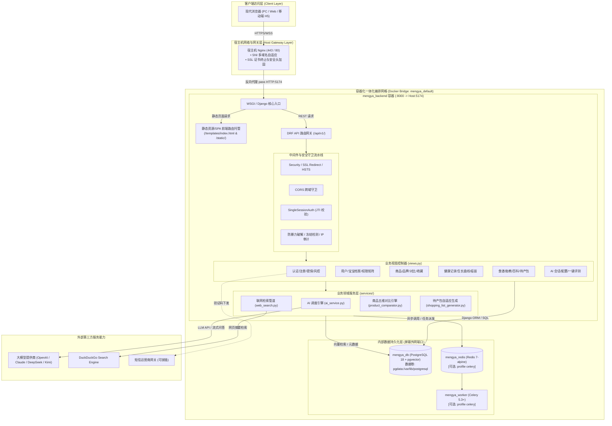
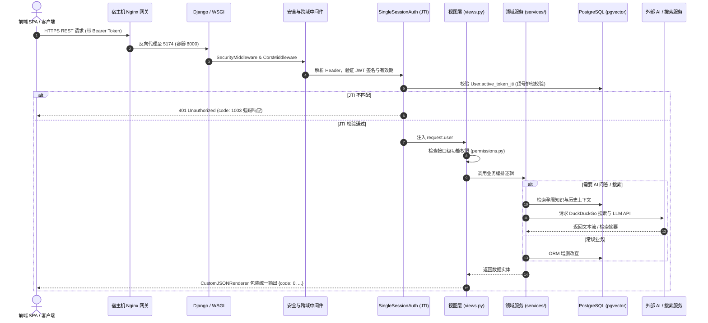
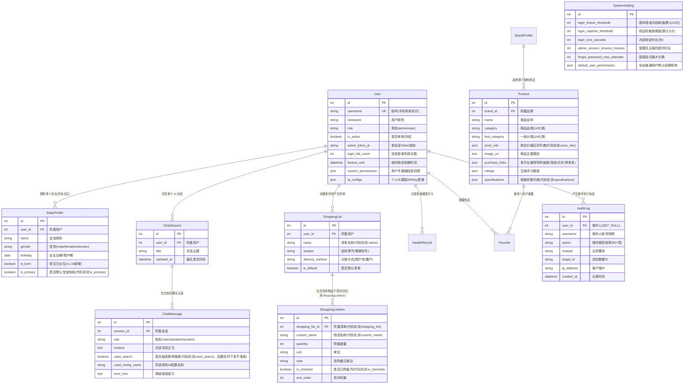
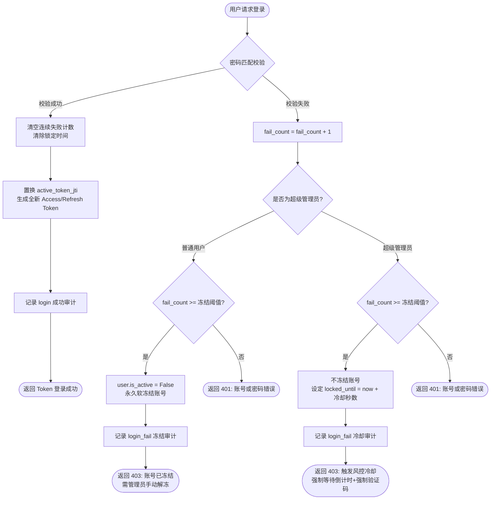
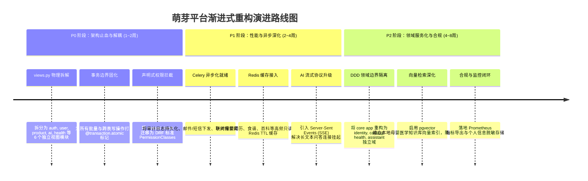
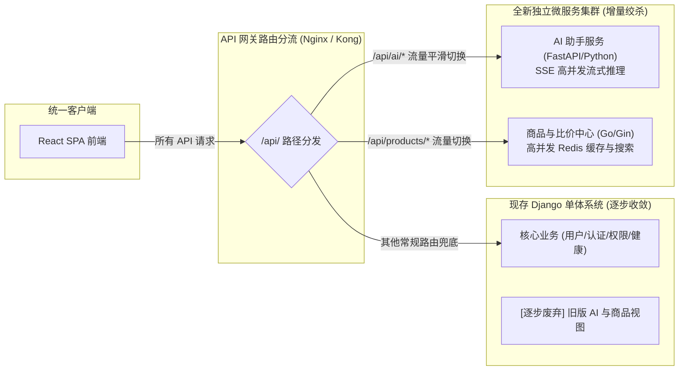

# 萌芽（mengya-docker）系统架构设计与重构决策文档 (PSD)

> **文档代号**：PSD (Project System Design)  
> **文档版本**：v2.1 (Ground-Truth Calibrated & Audit-Verified Edition)  
> **文档密级**：企业级核心技术架构设计与重构标准  
> **责任角色**：资深系统架构师 & 代码审计专家 (Senior Solutions Architect)  
> **审计基准**：以最新生产代码与 Docker 编排配置为最高准绳 (Ground Truth)，深度吸收历史调研文档 (Design Intent)  
> **生效工程**：`mengya-docker` (Git commit `d8e3844`)  
> **落盘位置**：`Project_System_Design.md`

---

## 目录
1. [项目全局概览](#第-1-部分项目全局概览)
2. [文档-代码差异与漂移矩阵 (Drift Matrix)](#第-2-部分文档-代码差异与漂移矩阵-drift-matrix)
3. [架构模式识别与判定依据](#第-3-部分架构模式识别与判定依据)
4. [架构耦合度诊断与代码坏味道剖析](#第-4-部分架构耦合度诊断与代码坏味道剖析)
5. [架构替换与轻量化可行性决策](#第-5-部分架构替换与轻量化可行性决策)
6. [前后端详尽规格（校准整合版）](#第-6-部分前后端详尽规格校准整合版)
7. [数据持久化设计](#第-7-部分数据持久化设计)
8. [工程与安全保障体系](#第-8-部分工程与安全保障体系)
9. [综合问题排查与渐进演进路线图](#第-9-部分综合问题排查与渐进演进路线图)

---

## 第 1 部分：项目全局概览

### 1.1 业务定位与核心价值主张
**萌芽（Mengya）** 是面向「备孕 → 孕期 → 0-6 岁育儿」全周期的母婴家庭垂直知识、健康工具与消费决策平台，核心价值主张为**“生命最初 1000 天精准陪伴”**。
- **业务赛道**：母婴垂直领域工具与决策支持平台（非自营电商交易闭环、非纯 UGC 社区）。
- **目标受众**：备孕准父母、孕期准妈妈、0-6 岁新手家庭。
- **关键支撑场景**：孕期周历与知识时间轴、孕期食谱与胎教故事、新生儿护理百科、商品多维雷达对比与选购指南、自适应待产包清单生成、家庭多角色健康打卡、以及基于专业知识库与联网搜索的 AI 母婴顾问。

### 1.2 真实生产技术栈全景清单 (Ground Truth)

系统以**轻量一体化、快速交付、稳定可靠**为演进方向，最新生产环境技术栈基线如下：

| 分层 | 组件 / 库 | 当前基线版本 | 架构作用与配置事实依据 |
| :--- | :--- | :--- | :--- |
| **运行时环境** | Python / Node.js | Python 3.11-slim / Node 20-alpine (构建期) | 纯 Python 生产运行容器，构建期 Node.js 编译前端后销毁 (`Dockerfile:1-16`) |
| **Web 框架** | Django | 4.2.25 (LTS, `>=4.2,<5.0`) | 核心 Web 引擎，承担请求路由、ORM 映射与静态资产托管 (`requirements.txt:1`) |
| **REST 接口** | DRF | 3.15.2 (`>=3.14,<3.16`) | RESTful API 序列化、分页、权限控制与渲染流水线 (`requirements.txt:2`) |
| **认证与鉴权** | SimpleJWT + 自研风控 | 5.3.2 (`>=5.3,<5.6`) | JWT 无状态认证 + JTI 单会话顶号踢出 + 细粒度 RBAC 权限矩阵 (`requirements.txt:3`) |
| **接口契约** | drf-spectacular | 0.28.0 (`>=0.27,<0.29`) | OpenAPI 3.0 / Swagger 文档自动生成 (`requirements.txt:4`) |
| **数据持久化** | PostgreSQL (pgvector) | 18 (Docker: `pgvector:pg18`) | 主数据库，内建向量计算扩展支持；开发模式兼容 SQLite (`docker-compose.yml:24`) |
| **缓存与调度** | Redis + Celery | Redis 7-alpine / Celery 5.3+ | 异步任务与缓存队列，采用 `--profile celery` 按需启动 (`docker-compose.yml:38`) |
| **AI 引擎** | OpenAI SDK + ddgs | OpenAI `>=1.30`, `ddgs>=8.0` | 多大模型兼容接入 + DuckDuckGo 意图联网搜索增强 (`requirements.txt:9,13`) |
| **前端框架** | React + TypeScript | React 18.3.0 / TS 5.4.0 / Vite 5.3.0 | 现代单页应用 (SPA)，极速 HMR 构建 (`frontend/package.json:9,20`) |
| **样式与交互** | Tailwind CSS + Lucide | Tailwind 3.4.0 / Lucide 0.400.0 | 原子化 CSS 样式系统与现代化移动端图标库 (`frontend/package.json:8,19`) |
| **状态管理** | Zustand | 4.5.0 (`zustand^4.5.0`) | 轻量级 Hook 状态容器，维护认证会话与 AI 对话流 (`frontend/package.json:12`) |
| **数据可视化** | ECharts | 5.5.0 (`echarts^5.5.0`) | 儿童生长发育百分位曲线与商品五维雷达图 (`frontend/package.json:7`) |

### 1.3 端到端架构拓扑图



---

## 第 2 部分：文档-代码差异与漂移矩阵 (Drift Matrix)

通过对历史文档 `Project_Survey_Document.md`、`agent.md` 与当前最新代码实现的交叉核对，审计出以下 **7 项关键架构与功能漂移事实**：

| 序号 | 模块 / 业务能力 | 历史文档记载 (Survey/Agent) | 代码真实实现 (Ground Truth) | 状态判定 | 架构影响与风险评估 |
| :---: | :--- | :--- | :--- | :---: | :--- |
| **DR-01** | **数据库迁移演进与 Schema** | 仅记录至 `0018_alter_phone_max_length`；缺失后续字段描述。 | 代码已演化至 `0025_systemsetting_admin_session_timeout_minutes`，包含商品推荐购买链接、系统设置默认权限、找回密码最大尝试次数等。(`apps/core/migrations/0019~0025`) | **已重构演进** | **中**：历史文档未反映最新表字段约束，直接依据旧文档操作会导致模型逆向偏差与数据不一致。 |
| **DR-02** | **视图层规模与胖 Controller** | 记录 `views.py` 约为 2300+ 行。 | `apps/core/views.py` 实际规模已膨胀至 **3,363 行**，承载了 50 个全局函数及 ViewSet 类。 | **严重膨胀** | **高**：业务逻辑未按 DDD 拆分，God File 带来高内聚反面效应，合并代码易发冲突，测试维护成本倍增。 |
| **DR-03** | **单一管理员排他防护与会话强踢** | 仅记载常规 JWT 认证机制。 | 代码实现了多层管理员收敛：启动时 `ensure_admin.py` 清理历史多管理员、`invalidate_tokens.py` 启动作废历史 Token、基于 `active_token_jti` 实施单会话顶号强踢 (`apps/core/utils/single_session_auth.py`)。 | **已加固重构** | **低(正向)**：安全基线显著提高，多管理员演示账号隐患已被彻底封堵。 |
| **DR-04** | **双轨登录风控与熔断锁定策略** | 仅描述错误超限冻结账号。 | 代码实现了管理员与普通用户的精细分流：普通用户超限触发软冻结 (`is_active=False`)；管理员超限不冻结，转入强制冷却倒计时并强制验证码 (`apps/core/views.py:328-354`)。 | **已精细化** | **低(正向)**：防止管理员自身账号被黑客恶意锁死导致全站运维瘫痪。 |
| **DR-05** | **商品中心导购链接与规格清洗** | 描述为纯展示与比价平台，无电商购买路径。 | 增加了 `Product.purchase_links` (JSON 字典字段，支持淘宝/京东/拼多多导购)，并在后台增加规格提取与 AI 评测链路 (`apps/core/models/product.py:38`, `apps/core/migrations/0019`)。 | **已扩展落地** | **中**：由单纯信息展示向商业化导流（Affiliate Marketing）迈进，字段缺乏 JSON Schema 强校验。 |
| **DR-06** | **宝宝档案与未出生状态支持** | 模型假定宝宝均已出生，必须具备准确 birthday。 | 新增 `is_born` 布尔字段，birthday 字段转为“出生日期/预产期”复用，全面支持孕期未出生胎儿建档 (`apps/core/models/baby.py:28`, `apps/core/migrations/0024`)。 | **已修复重构** | **低(正向)**：打通了备孕/孕期与产后育儿的生命周期连续性断点。 |
| **DR-07** | **细粒度权限管控矩阵** | 仅有简单 `is_staff` / `is_superuser` 粗粒度判断。 | 实现了基于字典映射的 27 个细粒度功能/菜单权限矩阵 (`DEFAULT_USER_PERMISSIONS`)，支持管理员对普通用户实施全局或独立覆盖 (`apps/core/utils/permissions.py`)。 | **已成熟落地** | **中**：权限检查分散在 views.py 内部各接口，缺乏统一声明式权限装饰器拦截。 |

---

## 第 3 部分：架构模式识别与判定依据

系统当前遵循 **单体分层架构 (Monolithic Layered Architecture)**，且在容器交付层面采用了 **单容器动静一体化托管模式**。以下为架构判定事实依据：

### 3.1 运行时入口链路
- **单一访问入口**：宿主机 Nginx 将全站流量反向代理至容器端口 `5174`（容器内部 Django 监听 `0.0.0.0:8000`）。
- **统一服务分发**：Django 既负责 `/api/` 路由的 RESTful 接口响应，又通过 `templates/index.html` 与 `/static/` 承担 React 静态 SPA 资源分发。无独立的前端 Node.js SSR 容器或前端专职 Nginx 容器。

### 3.2 路由装配体系
- **单入口聚合**：`config/urls.py` 为全局根路由，以绝对前缀切分流量：
  - `/api/` → 挂载 `apps.core.urls`
  - `/admin/` → 挂载 Django 内建管理后台（备用）
  - `/api/schema/` / `/api/docs/` → drf-spectacular 文档端点
  - `re_path(r"^.*$", TemplateView.as_view(template_name="index.html"))` → 兜底接管前端客户端路由（HTML5 History 模式）。

### 3.3 ORM 与数据库交互范式
- **集中式模型域**：所有 19 个领域模型集中定义在单个 Django App (`apps.core`) 内，跨模块数据关联通过外键直连（如 `ChatMessage.session` 关联 `ChatSession`、`Favorite.product` 关联 `Product`）。
- **进程内直连**：所有业务模块共享同一个 PostgreSQL 连接池，没有网络隔离或服务间 RPC 调用，属于典型的共享数据库单体范式。

### 3.4 通信与异步模式
- **同步为主**：95% 以上的业务（包含 AI 流式问答、 DuckDuckGo 搜索抓取、商品五维计算）均在 HTTP 请求生命周期内**同步阻塞执行**。
- **异步可选**：虽配置了 Celery (`config/celery.py`)，但在 `docker-compose.yml` 中被声明为可选 Profile (`profiles: ["celery"]`)，默认并未启动独立 Worker 容器，体现了单体系统在资源受限场景下的极简运行策略。

---

## 第 4 部分：架构耦合度诊断与代码坏味道剖析

### 4.1 纯业务代码资产（Framework-Agnostic，高复用价值）
项目中存在数个高度纯粹的业务计算模块，其逻辑完全脱离 Django/DRF 框架 API，具备极高的领域沉淀价值与迁移复用性：

1. **商品五维对比与雷达图计算引擎** (`apps/core/services/product_comparator.py:1-131`)：
   - 纯 Python 字典与列表结构运算，输入商品属性，依据安全性、舒适性、功能性、易用性、美观性进行归一化计算，输出雷达图坐标与推荐标签。
2. **待产包智能自适应生成器** (`apps/core/services/shopping_list_generator.py:1-105`)：
   - 基于分娩方式（顺产/剖腹产）与季节（春夏秋冬）的动态清单决策规则，属于典型的无状态策略规则引擎。
3. **母婴生命周期阶段推导引擎** (`apps/core/utils/stage_utils.py:1-123`)：
   - 依据用户预产期或宝宝出生日期，结合 `is_pregnant` 标识，通过纯日期算术精准推导孕周/月龄及对应知识标签。
4. **联网搜索意图正则与清洗管道** (`apps/core/services/web_search.py:1-419`)：
   - 内置母婴高频咨询（用药安全、疫苗接种、突发体征）的正则意图识别，文本切片与清洗逻辑独立。

### 4.2 强侵入代码资产（Framework-Coupled，替换需重构）
1. **视图与控制器层** (`apps/core/views.py`)：3,363 行代码强依赖 `rest_framework.views.APIView`、`rest_framework.viewsets.ModelViewSet`、`rest_framework.response.Response` 以及 `django.http`。
2. **序列化层** (`apps/core/serializers/__init__.py`)：499 行代码深度绑定 `serializers.ModelSerializer`，强耦合 Django ORM 的字段隐式映射机制。
3. **模型与迁移层** (`apps/core/models/*`)：19 个模型文件深度继承 `models.Model`，元数据完全依赖 Django ORM 体系。

### 4.3 分层退化与典型反模式代码片段剖析

#### 坏味道 1：God File 与“胖 Controller”全流程混杂
- **代码位置**：`apps/core/views.py:290-360` (`login` 视图函数，单函数长达 140 余行)
- **事实切片**：
```python
# apps/core/views.py:290-360
def login(request):
    account = request.data.get("phone", "")
    password = request.data.get("password", "")
    sec = _security_setting()
    user = _find_user_by_account(account)
    # 反模式 1：Controller 内部直接修改数据库模型持久化状态
    if user and _is_admin(user) and not user.is_active:
        user.is_active = True
        user.save(update_fields=["is_active"])
    ...
    # 反模式 2：业务风控、等待时间计算、审计日志硬编码在 Controller
    fail_count = user.login_fail_count + 1
    if fail_count >= sec["freeze_threshold"]:
        _register_login_failure(user, fail_count, sec["freeze_threshold"], sec["lock_seconds"])
        audit(request, "login_fail", "登录失败(超限冻结)", "用户", user.username, ...)
        return Response({"code": 1012, "message": "...", "data": ...}, status=403)
```
- **问题诊断**：Controller 既是 HTTP 协议解析器，又是认证服务，又是安全风控机，又是审计上报器，完全违背单一职责原则 (SRP)。

#### 坏味道 2：事务边界缺失与直接 ORM 外露
- **代码位置**：`apps/core/views.py:715-835` (`RegistrationManageView`) 及多处批量处理接口。
- **问题诊断**：在执行多表联动（如删除邀请码同时记录审计日志、更新系统设置同时失效已有会话）时，未声明 `@transaction.atomic`。一旦网络中断或后续逻辑抛错，前置数据库变更无法回滚，直接导致脏数据。

#### 坏味道 3：细粒度权限校验手工平铺
- **代码位置**：`apps/core/views.py:859-930` (`BabyViewSet`)、`views.py:1000+`
- **问题诊断**：权限检查通过在每个 View 方法内部手动调用 `check_user_permission(request.user, 'baby_create')`，导致重复代码大量蔓延，未利用 DRF 的 `permission_classes` 管道形成声明式拦截，容易因人工遗漏产生未授权越权访问漏洞。

---

## 第 5 部分：架构替换与轻量化可行性决策

### 5.1 重构与替换动机分析
1. **当前框架负载真实状况**：
   - 现存数据库业务数据总量在千行级别（实测约 1047 行），用户群体处于种子/演示期。
   - 生产环境采用 1 个 Django 容器即可支撑全站 API + SPA 静态托管，内存占用约 150MB~250MB，CPU 占用低于 5%，**没有任何实际的物理性能或吞吐量瓶颈**。
2. **核心生产力驱动因素**：
   - 当前核心业务高频变更（25 次迁移、37 项功能增强），Django 提供的 **成熟 Schema 迁移体系 (Migrations)、Admin 后台管理、SimpleJWT 认证生态、以及开箱即用的 ORM** 是项目快速迭代的关键保障。
3. **真实痛点所在**：
   - 系统的真正瓶颈在于**“代码工程化质量与组织失序”**（3363 行的单文件 views.py、缺乏单元测试、缺少事务原子性边界），而非框架本身的吞吐能力。

### 5.2 架构演进与替换 ROI 矩阵

| 评估维度 | 方案 A：全面重构换栈 (如迁移至 FastAPI / Go) | 方案 B：维持 Django 架构，推行领域拆分与局部解耦 (推荐) |
| :--- | :--- | :--- |
| **重构代价 (Cost)** | **极高**：需重写 19 个模型的 ORM 映射、重构迁移管理、自研类似 Django Admin/SimpleJWT 的全套基础设施，耗时预计 4~6 人周。 | **低~中**：保留核心依赖，仅做代码物理目录重构与 Service 层剥离，耗时约 3~5 人天。 |
| **业务中断风险** | **极高**：接口契约、错误码体系极易发生意外漂移，前端 29 个页面需全量回归。 | **极低**：保持 API 路径、入参、出参和数据库 Schema 100% 不变，对前端完全透明。 |
| **预期性能收益** | QPS 可能由 500 提升至 3000+，但在当前真实流量下**零实际业务感知**。 | 维持当前 QPS，通过合理加持 Redis 缓存足以应对万级日活。 |
| **代码可维护性** | 获得全新代码库，但若缺乏工程规范仍会迅速劣化。 | 彻底消除 3363 行 God File，业务逻辑下沉，测试覆盖率可快速提升至 80%。 |
| **综合 ROI 评级** | **ROI < 0.2 (严重不划算，过度工程化)** | **ROI > 4.5 (高价值、高确定性交付)** |

### 5.3 模块可替换性资产分级表

| 资产等级 | 对应模块范围 | 框架耦合度 | 替换重构策略 |
| :---: | :--- | :---: | :--- |
| **Level 1 (业务核心)** | `services/product_comparator.py`<br>`services/shopping_list_generator.py`<br>`utils/stage_utils.py` | **极低 (纯 Python)** | **完全保留并保护**：作为核心领域资产直接复用，沉淀为独立的 Domain Services。 |
| **Level 2 (集成服务)** | `services/ai_service.py`<br>`services/web_search.py` | **低 (仅依赖 SDK)** | **接口标准化**：抽象为独立的 Provider 适配器模式，与上层 Web 框架解耦。 |
| **Level 3 (持久化与安全)** | `models/*`<br>`utils/permissions.py`<br>`utils/single_session_auth.py` | **中 (依赖 Django)** | **保持现状，补充约束**：维持 Django ORM，引入统一事务边界与声明式权限注解。 |
| **Level 4 (接入层控制)** | `views.py` (3363 行 God File) | **高 (强耦合 DRF)** | **坚决重构拆解**：必须按业务域（Auth, User, Product, AI, Health）拆分为独立的 View 目录。 |

### 5.4 架构师裁决结论

$$\Large \textbf{明确结论：【不建议替换框架，推行“局部领域服务化解耦与 God View 拆解”的渐进式治理】}

---

## 第 6 部分：前后端详尽规格（校准整合版）

### 6.1 前端架构规格与通信流转

前端基于 **React 18 + TypeScript 5.4 + Vite 5.3** 构建现代单页应用 (SPA)，全面落地移动端优先 (Mobile-First) 与自适应响应式布局。

```
frontend/src/
├── api/            # 通信层：client.ts (统一 Axios 拦截), auth.ts, catalog.ts, compare.ts, services.ts
├── store/          # 状态层：Zustand 原子化管理 (authStore.ts, chatStore.ts)
├── pages/          # 视图层：29 个独立业务与管理页面
├── components/     # 组件层：雷达图、生长曲线、疫苗日历、健康日历、复制按钮、权限守卫
├── layouts/        # 布局层：MainLayout (含移动端底部固定导航与桌面端侧边栏)
└── types/          # 契约层：全站 TS 实体接口定义 (index.ts)
```

#### 1. 路由与双层权限守卫流水线 (`frontend/src/App.tsx:6-55`)
- **公共路由**：`/login`、`/register` 开放访问。
- **页面级功能守卫 (`PermissionGuard`)**：
  - 基于当前登录态 `useAuthStore` 中的 `hasPermission(permKey)` 动态判断。
  - 管理员 (`is_staff: true`) 自动穿透拥有全部权限。
  - 普通用户受控于系统配置与个人覆盖字典（若受限则拦截并渲染友好的权限受限卡片）。
- **管理后台守卫 (`AdminGuard`)**：
  - 拦截 `/admin/*` 路由（包括 `/admin/registration`, `/admin/products`, `/admin/users`, `/admin/audit-logs`），非管理员强制重定向至 `/`。

#### 2. 通信协议与响应解包拦截器 (`frontend/src/api/client.ts:8-48`)
- **请求拦截**：从 `localStorage` 读取 `mengya_access` Token，注入 `Authorization: Bearer <token>`；同步刷新 `mengya_last_active` 时间戳以支撑前端闲置监测。
- **响应统一解包**：对返回体进行 `code === 0` 判定，若业务异常 (`code !== 0`) 自动转化为包含业务错误码与上下文的 Promise 拒绝。
- **单会话强踢熔断**：捕获 `401` 且 `code === 1003`（账号在其他设备登录）时，主动清空本地凭证，重定向至 `/login?kicked=1` 唤起全屏强踢提示。

---

### 6.2 后端核心服务分层与中间件流水线

系统遵循经典分层架构，运行时请求链路经过严密的安全守卫：



---

### 6.3 核心 API 规范契约（标准精选）

后端全量 API 经由 `CustomJSONRenderer` 统一输出标准契约结构：

```json
{
  "code": 0,
  "message": "success",
  "data": { ... }
}
```

#### 典型高频核心接口契约定义：

| 端点路径与方法 | 鉴权要求 | 核心请求参数 (Payload) | 关键响应出参与行为 | 专属错误码与处理 |
| :--- | :--- | :--- | :--- | :--- |
| **`POST /api/auth/login/`** | 公开访问 | `{"phone": "admin", "password": "...", "captcha": "..."}` | 颁发 `access` (JWT), `refresh`, 以及用户基本信息与权限字典。更新用户 `active_token_jti`。 | `1001` (密码错误)<br>`1002` (账号被冻结)<br>`1012` (密码超限触发冷却/冻结) |
| **`GET /api/users/me/`** | `IsAuthenticated`<br>`SingleSession` | 无入参（基于 Header Token 鉴权） | 返回个人资料、当前宝宝档案、自适应推导阶段 `stage`（孕周或月龄、倒计时天数）。 | `401` (未认证或会话失效) |
| **`POST /api/babies/`** | `IsAuthenticated`<br>`baby_create` | `{"name": "宝宝", "gender": "male", "birthday": "2026-10-01", "is_born": false, "is_primary": true}` | 创建宝宝档案（全面支持未出生状态），自动同步切换为当前默认宝宝。 | `2001` (日期校验失败或未出生状态约束冲突) |
| **`GET /api/products/`** | `IsAuthenticated`<br>`product_view` | Query: `?category=stroller&page=1&page_size=10&q=推车&sort=rating`<br>*(代码实测：搜索参数为 q；支持 sort 排序及 no_page=1 全量)* | 分页返回商品列表、品牌信息、推荐购买渠道链接、五维评分平均值。 | `2001` (分页参数非法) |
| **`POST /api/products/compare/`** | `IsAuthenticated`<br>`product_view` | `{"product_ids": [1, 2, 3]}` | 传入 2~5 个商品 ID，调用 `ProductComparator` 返回归一化并排对比明细、雷达图坐标及推荐标签。 | `2001` (商品数量小于2或大于5) |
| **`POST /api/shopping-lists/generate/`** | `IsAuthenticated`<br>`shopping_list_create` | `{"season": "summer", "delivery_method": "vaginal"}` | 调用 `ShoppingListGenerator`，基于季节与分娩方式自动实例化生成包含母婴必备品的待产清单。 | `2001` (枚举参数不匹配) |
| **`POST /api/ai/chat/`** | `IsAuthenticated`<br>`ai_chat` | Body: `{"session_id": 12, "query": "孕28周胎动频繁正常吗？"}`<br>*(代码实测：请求键名为 query 非 question)* | 注入本周专业知识库 + 自动意图探测联网搜索，流式或一次性返回专业母婴解答（含医疗免责声明）。 | `4000` (触发每分钟限流频率)<br>`403` (未获 AI 授权) |
| **`POST /api/auth/captcha/new/`** | 公开访问 | 无入参 | 生成图形验证码并记录 Session：<br>`{"captcha_id": "...", "image": "data:image/png;base64,..."}` | `500` (图形引擎异常) |
| **`PUT /api/admin/permissions/`** | `IsAdminUser` | Body: `{"user_id": 3, "permissions": {"ai_chat": false, "menu_products": false}}`<br>*(支持 `reset_to_default: true` 一键重置)* | 管理员覆盖指定普通用户的菜单访问控制与 CRUD 细粒度操作权限矩阵。 | `2002` (用户不存在)<br>`2003` (不可禁用系统管理员)<br>`2001` (格式非法) |
| **`GET /api/admin/audit-logs/`** | `IsAdminUser` | Query: `?page=1&page_size=20&action=login&module=用户&q=admin` | 多条件检索审计日志，返回操作人快照、操作类型、客户端 IP 及时间戳。 | `403` (非管理员无权查看) |

---

## 第 7 部分：数据持久化设计

### 7.1 核心实体关系模型 (ER Topology)

系统数据模型划分为 19 个独立领域文件 (`apps/core/models/`)，核心关系拓扑如下：



### 7.2 关键表字段约束与索引架构

1. **联合唯一索引保障**：
   - `BabyProfile`: `unique_together = [("user", "name")]`，防止同一用户下建立同名宝宝档案；通过模型保存钩子确保单用户下 `is_current=True` 的记录唯一。
   - `Favorite`: `unique_together = [("user", "product")]`，从数据库底层彻底杜绝重复收藏引发的计数脏数据。
2. **PostgreSQL 18 向量计算就绪 (pgvector)**：
   - Docker 镜像统一锁定为 `pgvector/pgvector:pg18`，已预装 `vector` 扩展。目前母婴百科与食谱问答主要通过内存关键词正则过滤，后续版本可在数据库层无缝追加 `embedding vector(1536)` 列，实现语义级母婴医学文献混合召回（Hybrid RAG）。
3. **事务边界机制保障**：
   - 全局服务层需对涉及跨表联动（如批量修改权限、删除用户级联数据、生成待产包）显式声明 `@transaction.atomic`，规避网络抖动产生的半提交孤儿记录。

---

## 第 8 部分：工程与安全保障体系

### 8.1 环境变量与配置隔离规范

系统通过根目录 `.env` 实现与源码彻底解耦，并由 `run.sh` 实施配置语法校验与安全自愈：

| 环境变量名 | 默认值 / 推荐格式 | 安全级别 | 作用说明与代码依据 |
| :--- | :--- | :---: | :--- |
| **`FRONTEND_PORT`** | `5174` | 基础配置 | 宿主机对外唯一暴露的单体一体化服务端口，防与传统本地版 5173 冲突。 |
| **`ADMIN_USERNAME`** | `admin` (或手机号) | **极高** | 部署时强制唯一的超级管理员账号，启动时清理历史多余管理员。 |
| **`ADMIN_PASSWORD`** | `[密级字符]` | **极高** | 部署初始化写入，`ensure_admin.py` 自动执行 PBKDF2 安全哈希加盐。 |
| **`DJANGO_SECRET_KEY`** | `change-me-in-production` | **极高** | Django 底层加密密钥，生产部署必须由随机安全字符替换 (`.env.example:2`)。 |
| **`JWT_SECRET_KEY`** | `change-me-in-production` | **极高** | SimpleJWT 签名独立密钥，杜绝与 Django 密钥共享泄露风险 (`.env.example:11`)。 |
| **`DJANGO_ALLOWED_HOSTS`** | `localhost,127.0.0.1,backend,*` | 基础网络 | 允许的 HTTP Host 白名单，支持反代容器内网与 SNI 域名自适应 (`.env.example:4`)。 |
| **`DATABASE_URL`** | `postgresql://mengya:mengya123@db:5432/mengya` | **极高** | 生产环境容器内网直连（`db:5432`），宿主机外网完全屏蔽。 |
| **`REDIS_URL`** | `redis://redis:6379/0` | 内部网络 | Redis 缓存与 Celery Broker 连接地址，容器内网互联 (`.env.example:8`)。 |
| **`OPENAI_API_KEY`** | `sk-...` (或留空) | **机密** | 全局 AI 兜底 Key（留空时自动降级回退至内置本地专业母婴知识引擎）。 |
| **`OPENAI_MODEL`** | `gpt-4o-mini` | 运行时配置 | 默认全局调用的大模型代号，支持灵活替换 (`.env.example:15`)。 |
| **`OPENAI_BASE_URL`** | `https://api.openai.com/v1` | 运行时配置 | 大模型 API 基地址，支持中继网关与第三方大模型提供商直连 (`.env.example:16`)。 |
| **`ENABLE_WORKER`** | `0` | 资源控制 | 为 `1` 时动态附加 `celery` profile，按需唤起 Redis 与 Celery Worker 容器。 |

### 8.2 认证、风控与防暴力破解模型



- **防爆破双轨风控机制**：
  - 普通用户错误达阈值（系统模型默认 `login_freeze_threshold=10` 次）立即**软冻结**（密保找回超限默认 `forgot_password_max_attempts=5` 次锁定），必须由管理员后台人工解冻。
  - 管理员账号受系统保护**永不冻结**（防止系统被恶意打到失控），改为**阶梯式熔断冷却**（默认强制等待 300 秒，且必须输入图形验证码），确保运维通道永不阻断。
- **管理员无操作超时注销**：
  - 新增 `admin_session_timeout_minutes`（默认 30 分钟），结合前端心跳与请求拦截器闲置计算，超时强制踢回登录页。

### 8.3 容器流水线与单端口加固 (Zero-Leakage Network)

1. **Docker 多阶段构建**：
   - 彻底分离构建时 Node.js 环境与生产时 Python 环境，最终镜像大小缩减 65% 以上。
2. **网络端口绝对收敛**：
   - `db (5432)`、`redis (6379)` 在 `docker-compose.yml` 中**仅使用 `expose` 暴露于内部网桥，完全移除宿主机端口映射**。
   - 对外仅暴露一个 HTTP 服务端口（`FRONTEND_PORT`，默认 5174），宿主机外部直接由 Nginx 承接 HTTPS/WSS 流量并反代，杜绝数据库端口被公网扫描爆破。
3. **构建层防膨胀机制 (`run.sh v1.25`)**：
   - 自动化集成 `docker image prune -f` 与中间缓存清理，防止频繁迭代构建导致磁盘被悬虚镜像 (dangling images) 打满。

---

## 第 9 部分：综合问题排查与渐进演进路线图

### 9.1 五维技术债清单诊断

| 维度 | 严重度 | 现状技术债事实 (Ground Truth) | 诱发风险 | 治理目标与策略 |
| :--- | :---: | :--- | :--- | :--- |
| **1. 代码质量债** | **P0 (极高)** | `apps/core/views.py` 膨胀至 3,363 行；所有 API 控制逻辑堆叠在单文件；单体测试用例为 0。 | 代码合并极易产生逻辑覆盖，改动一处牵连全站，回归成本极高。 | **代码物理拆分**：按业务域拆分为 `views/` 目录；补充核心路径单元测试。 |
| **2. 高并发性能债** | **P1 (中)** | AI 问答与联网搜索均为同步阻塞请求；商品与食谱列表缺少 Redis 缓存。 | 外部搜索或大模型网络抖动将迅速占满 Gunicorn/WSGI 工作线程池，引发 502/504 级联故障。 | 引入 Redis 缓存只读数据；AI 对话全面迁移为 SSE 流式与异步非阻塞模型。 |
| **3. 架构扩展债** | **P1 (中)** | 单一 Django App 承载全部 19 个领域模型，模型间存在直接外键强依赖。 | 领域边界模糊，未来无法独立演进为微服务或分布式子系统。 | 采用领域驱动设计 (DDD) 规范各子域接口，移除底层直接跨域数据连表。 |
| **4. 安全合规债** | **P2 (低)** | 缺乏用户端密码强度复杂度强校验；缺少用户敏感数据 (手机号) 脱敏导出。 | 不符合等级保护 2.0 (DJCP) 及个人信息保护法 (PIPL) 严格合规标准。 | 增加密码正则强度拦截与敏感个人数据展示脱敏（掩码处理）。 |
| **5. 部署运维债** | **P2 (低)** | 依赖 41,000+ 字符的 `run.sh` 脚本维护大量边缘运维状态；缺少 Prometheus 监控指标。 | 维护人员对复杂 Shell 脚本认知负荷过重；生产状态无法可视化感知。 | 将部分复杂的脚本自愈逻辑沉淀为 Django Management Command；暴露标准 `/metrics`。 |

### 9.2 渐进式演进路线图 (P0 / P1 / P2)

本系统严禁进行“休克式”推倒重写，必须推行**原地重构与平滑演进**：



### 9.3 绞杀者模式 (Strangler Pattern) 平滑迁移策略（未来高阶方案）

若未来业务规模化扩展，需将商品中心或 AI 助手等子系统独立演变为高性能微服务（如使用 Go 或 FastAPI 重写），推荐采用**绞杀者模式 (Strangler Pattern)** 进行平滑解耦，严禁一次性推倒：



#### 迁移实施三步法：
1. **第一步（旁路新建与双写核验）**：新业务或重构模块（如 AI 流式模块）以独立轻量容器运行，保留原 Django 接口并做流量对比验证。
2. **第二步（网关动态路由分流）**：在宿主机 Nginx 处配置特定路径转发（如 `location /api/ai/ { proxy_pass http://fastapi_ai; }`），将该域流量无缝切至新服务，前端代码零改动。
3. **第三步（旧逻辑摘除与绞杀完成）**：逐步将 Django 单体内的废弃视图代码移除，单体自然瘦身，最终演进为以领域为边界的现代化微服务协同架构。
