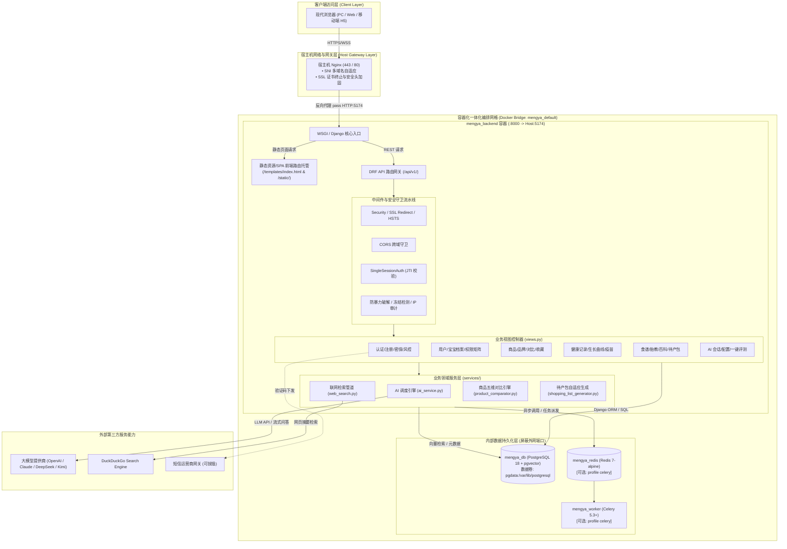
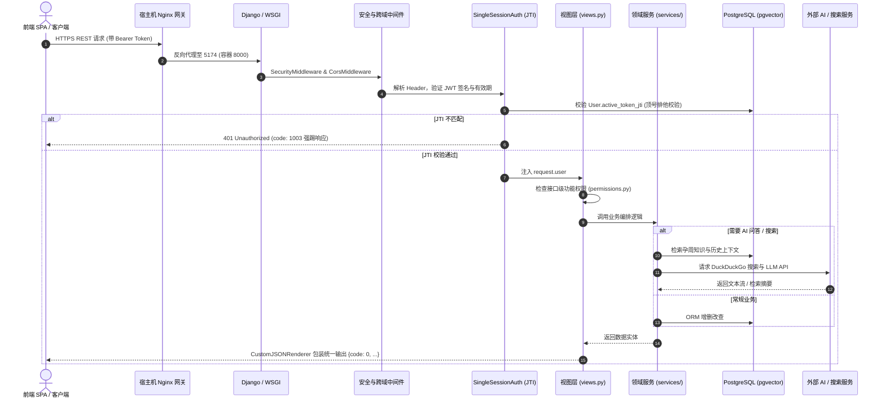
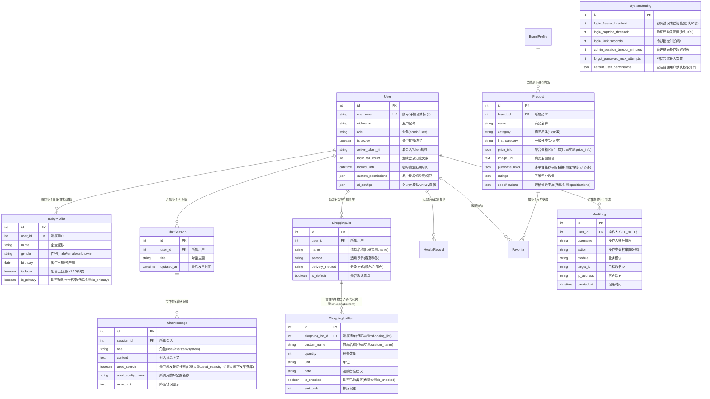
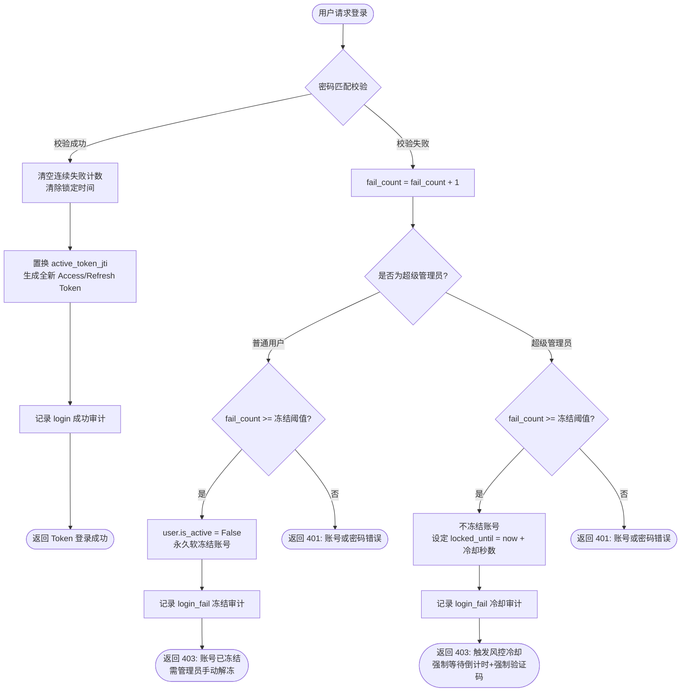
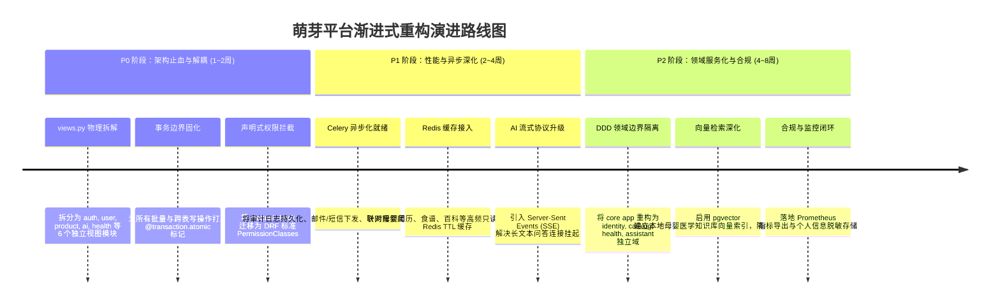
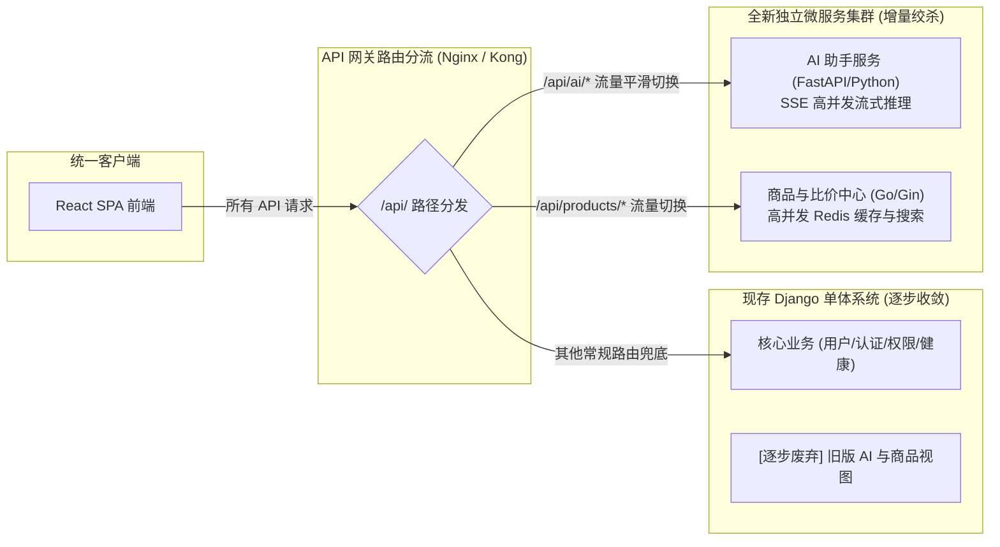
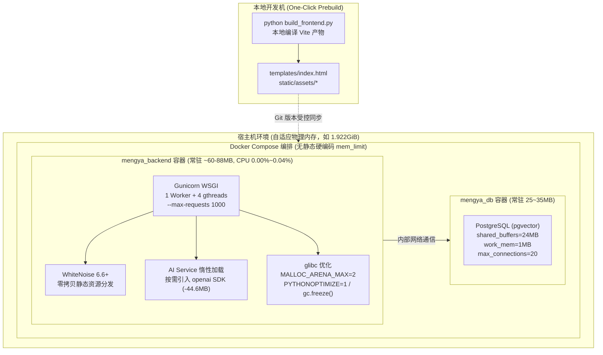

# 萌芽（mengya-docker）系统架构设计与重构决策文档 (PSD)

> **文档代号**：PSD (Project System Design)  
> **文档版本**：v2.2 (Ultra-Low Resource Optimization & Self-Adaptive Host Memory Edition)  
> **文档密级**：企业级核心技术架构设计与重构标准  
> **责任角色**：资深系统架构师 & 代码审计专家 (Senior Solutions Architect)  
> **审计基准**：以最新生产代码与 Docker 编排配置为最高准绳 (Ground Truth)，深度吸收历史调研文档 (Design Intent)  
> **生效工程**：`mengya-docker`（分支：`mengya-docker-optimize`）  
> **落盘位置**：`Project_System_Design.md`

---

## 目录
1. [项目全局概览](#第-1-部分项目全局概览)
2. [文档-代码差异与漂移矩阵 (Drift Matrix)](#第-2-部分文档-代码差异与漂移矩阵-drift-matrix)
3. [架构模式识别与判定依据](#第-3-部分架构模式识别与判定依据)
4. [架构耦合度诊断与代码坏味道剖析](#第-4-部分架构耦合度诊断与代码坏味道剖析)
5. [架构替换与轻量化可行性决策](#第-5-部分架构替换与轻量化可行性决策)
6. [前后端详尽规格（校准整合版）](#第-6-部分前后端详尽规格校准整合版)
7. [数据持久化设计](#第-7-部分数据持久化设计)
8. [工程与安全保障体系](#第-8-部分工程与安全保障体系)
9. [综合问题排查与渐进演进路线图](#第-9-部分综合问题排查与渐进演进路线图)
10. [极致低资源 Docker 容器化性能优化与自适应规格体系](#第-10-部分极致低资源-docker-容器化性能优化与自适应规格体系-v22)

---

## 第 1 部分：项目全局概览

### 1.1 业务定位与核心价值主张
**萌芽（Mengya）** 是面向「备孕 → 孕期 → 0-6 岁育儿」全周期的母婴家庭垂直知识、健康工具与消费决策平台，核心价值主张为**“生命最初 1000 天精准陪伴”**。
- **业务赛道**：母婴垂直领域工具与决策支持平台（非自营电商交易闭环、非纯 UGC 社区）。
- **目标受众**：备孕准父母、孕期准妈妈、0-6 岁新手家庭。
- **关键支撑场景**：孕期周历与知识时间轴、孕期食谱与胎教故事、新生儿护理百科、商品多维雷达对比与选购指南、自适应待产包清单生成、家庭多角色健康打卡、以及基于专业知识库与联网搜索的 AI 母婴顾问。

### 1.2 真实生产技术栈全景清单 (Ground Truth)

系统以**轻量一体化、快速交付、稳定可靠**为演进方向，最新生产环境技术栈基线如下：

| 分层 | 组件 / 库 | 当前基线版本 | 架构作用与配置事实依据 |
| :--- | :--- | :--- | :--- |
| **运行时环境** | Python 3.11-slim | 3.11-slim | 单阶段纯 Python 生产运行容器，前端通过本地预构建（`build_frontend.py`）免除服务端 Node 依赖 (`Dockerfile`) |
| **Web 框架** | Django | 4.2.25 (LTS, `>=4.2,<5.0`) | 核心 Web 引擎，承担请求路由与 ORM 映射 (`requirements.txt:1`) |
| **应用服务器** | Gunicorn | `>=21.2.0` | 生产级 WSGI 容器，1 Worker + 4 Threads (gthread)，循环回收，彻底根除 runserver CPU 轮询空转 (`requirements.txt`, `docker-compose.yml`) |
| **静态托管** | WhiteNoise | `>=6.6.0` | 零拷贝静态文件派发，一体化提供 API 与前端 SPA 静态托管 (`config/settings.py`) |
| **REST 接口** | DRF | 3.15.2 (`>=3.14,<3.16`) | RESTful API 序列化、分页、权限控制与渲染流水线 (`requirements.txt:2`) |
| **认证与鉴权** | SimpleJWT + 自研风控 | 5.3.2 (`>=5.3,<5.6`) | JWT 无状态认证 + JTI 单会话顶号踢出 + 细粒度 RBAC 权限矩阵 (`requirements.txt:3`) |
| **接口契约** | drf-spectacular | 0.28.0 (`>=0.27,<0.29`) | OpenAPI 3.0 / Swagger 文档自动生成 (`requirements.txt:4`) |
| **数据持久化** | PostgreSQL (pgvector) | 18 (Docker: `pgvector:pg18`) | 主数据库，内建向量计算扩展支持；开发模式兼容 SQLite (`docker-compose.yml:24`) |
| **缓存与调度** | Redis + Celery | Redis 7-alpine / Celery 5.3+ | 异步任务与缓存队列，采用 `--profile celery` 按需启动 (`docker-compose.yml:38`) |
| **AI 引擎** | OpenAI SDK + ddgs | OpenAI `>=1.30`, `ddgs>=8.0` | 多大模型兼容接入 + DuckDuckGo 意图联网搜索增强 (`requirements.txt:9,13`) |
| **前端框架** | React + TypeScript | React 18.3.0 / TS 5.4.0 / Vite 5.3.0 | 现代单页应用 (SPA)，极速 HMR 构建 (`frontend/package.json:9,20`) |
| **样式与交互** | Tailwind CSS + Lucide | Tailwind 3.4.0 / Lucide 0.400.0 | 原子化 CSS 样式系统与现代化移动端图标库 (`frontend/package.json:8,19`) |
| **状态管理** | Zustand | 4.5.0 (`zustand^4.5.0`) | 轻量级 Hook 状态容器，维护认证会话与 AI 对话流 (`frontend/package.json:12`) |
| **数据可视化** | ECharts | 5.5.0 (`echarts^5.5.0`) | 儿童生长发育百分位曲线与商品五维雷达图 (`frontend/package.json:7`) |

### 1.3 端到端架构拓扑图


```mermaid
flowchart TB
    subgraph Client["客户端访问层 (Client Layer)"]
        Browser["现代浏览器 (PC / Web / 移动端 H5)"]
    end

    subgraph Host["宿主机网络与网关层 (Host Gateway Layer)"]
        HostNginx["宿主机 Nginx (443 / 80)<br/>• SNI 多域名自适应<br/>• SSL 证书终止与安全头加固"]
    end

    subgraph DockerEnv["容器化一体化编排网格 (Docker Bridge: mengya_default)"]
        subgraph BackendContainer["mengya_backend 容器 (:8000 -> Host:5174)"]
            DjangoEntry["WSGI / Django 核心入口"]
            StaticServe["静态资源/SPA 前端路由托管<br/>(/templates/index.html & /static/)"]
            APIRouter["DRF API 路由网关 (/api/v1/)"]
            
            subgraph MiddlewareStack["中间件与安全守卫流水线"]
                SecMW["Security / SSL Redirect / HSTS"]
                CorsMW["CORS 跨域守卫"]
                SingleSessionMW["SingleSessionAuth (JTI 校验)"]
                RiskMW["防暴力破解 / 冻结检测 / IP 审计"]
            end
            
            subgraph CoreViews["业务视图控制器 (views.py)"]
                AuthViews["认证/注册/密保/风控"]
                UserViews["用户/宝宝档案/权限矩阵"]
                ProductViews["商品/品牌/对比/收藏"]
                HealthViews["健康记录/生长曲线/疫苗"]
                ContentViews["食谱/胎教/百科/待产包"]
                AIViews["AI 会话/配置/一键评测"]
            end

            subgraph ServiceDomain["业务领域服务层 (services/)"]
                AIService["AI 调度引擎 (ai_service.py)"]
                WebSearch["联网检索管道 (web_search.py)"]
                Comparator["商品五维对比引擎 (product_comparator.py)"]
                ListGen["待产包自适应生成 (shopping_list_generator.py)"]
            end
        end

        subgraph StorageLayer["内部数据持久化层 (屏蔽外网端口)"]
            PGDB[("mengya_db (PostgreSQL 18 + pgvector)<br/>数据卷: pgdata:/var/lib/postgresql")]
            RedisQueue[("mengya_redis (Redis 7-alpine)<br/>[可选: profile celery]")]
            CeleryWorker["mengya_worker (Celery 5.3+)<br/>[可选: profile celery]"]
        end
    end

    subgraph ExternalCloud["外部第三方服务能力"]
        LLM["大模型提供商 (OpenAI / Claude / DeepSeek / Kimi)"]
        DDG["DuckDuckGo Search Engine"]
        SMS["短信运营商网关 (可拔插)"]
    end

    Browser -->|HTTPS/WSS| HostNginx
    HostNginx -->|反向代理 pass HTTP:5174| DjangoEntry
    DjangoEntry -->|静态页面请求| StaticServe
    DjangoEntry -->|REST 请求| APIRouter
    APIRouter --> MiddlewareStack
    MiddlewareStack --> CoreViews
    CoreViews --> ServiceDomain
    CoreViews -->|Django ORM / SQL| PGDB
    ServiceDomain -->|向量检索 / 元数据| PGDB
    ServiceDomain -->|异步调用 / 任务派发| RedisQueue
    RedisQueue --> CeleryWorker
    AIService -->|LLM API / 流式问答| LLM
    WebSearch -->|网页摘要检索| DDG
    AuthViews -.->|验证码下发| SMS
```

---

## 第 2 部分：文档-代码差异与漂移矩阵 (Drift Matrix)

通过对历史文档 `Project_Survey_Document.md`、`agent.md` 与当前最新代码实现的交叉核对，审计出以下 **7 项关键架构与功能漂移事实**：

| 序号 | 模块 / 业务能力 | 历史文档记载 (Survey/Agent) | 代码真实实现 (Ground Truth) | 状态判定 | 架构影响与风险评估 |
| :---: | :--- | :--- | :--- | :---: | :--- |
| **DR-01** | **数据库迁移演进与 Schema** | 仅记录至 `0018_alter_phone_max_length`；缺失后续字段描述。 | 代码已演化至 `0025_systemsetting_admin_session_timeout_minutes`，包含商品推荐购买链接、系统设置默认权限、找回密码最大尝试次数等。(`apps/core/migrations/0019~0025`) | **已重构演进** | **中**：历史文档未反映最新表字段约束，直接依据旧文档操作会导致模型逆向偏差与数据不一致。 |
| **DR-02** | **视图层规模与胖 Controller** | 记录 `views.py` 约为 2300+ 行。 | `apps/core/views.py` 实际规模已膨胀至 **3,363 行**，承载了 50 个全局函数及 ViewSet 类。 | **严重膨胀** | **高**：业务逻辑未按 DDD 拆分，God File 带来高内聚反面效应，合并代码易发冲突，测试维护成本倍增。 |
| **DR-03** | **单一管理员排他防护与会话强踢** | 仅记载常规 JWT 认证机制。 | 代码实现了多层管理员收敛：启动时 `ensure_admin.py` 清理历史多管理员、`invalidate_tokens.py` 启动作废历史 Token、基于 `active_token_jti` 实施单会话顶号强踢 (`apps/core/utils/single_session_auth.py`)。 | **已加固重构** | **低(正向)**：安全基线显著提高，多管理员演示账号隐患已被彻底封堵。 |
| **DR-04** | **双轨登录风控与熔断锁定策略** | 仅描述错误超限冻结账号。 | 代码实现了管理员与普通用户的精细分流：普通用户超限触发软冻结 (`is_active=False`)；管理员超限不冻结，转入强制冷却倒计时并强制验证码 (`apps/core/views.py:328-354`)。 | **已精细化** | **低(正向)**：防止管理员自身账号被黑客恶意锁死导致全站运维瘫痪。 |
| **DR-05** | **商品中心导购链接与规格清洗** | 描述为纯展示与比价平台，无电商购买路径。 | 增加了 `Product.purchase_links` (JSON 字典字段，支持淘宝/京东/拼多多导购)，并在后台增加规格提取与 AI 评测链路 (`apps/core/models/product.py:38`, `apps/core/migrations/0019`)。 | **已扩展落地** | **中**：由单纯信息展示向商业化导流（Affiliate Marketing）迈进，字段缺乏 JSON Schema 强校验。 |
| **DR-06** | **宝宝档案与未出生状态支持** | 模型假定宝宝均已出生，必须具备准确 birthday。 | 新增 `is_born` 布尔字段，birthday 字段转为“出生日期/预产期”复用，全面支持孕期未出生胎儿建档 (`apps/core/models/baby.py:28`, `apps/core/migrations/0024`)。 | **已修复重构** | **低(正向)**：打通了备孕/孕期与产后育儿的生命周期连续性断点。 |
| **DR-07** | **细粒度权限管控矩阵** | 仅有简单 `is_staff` / `is_superuser` 粗粒度判断。 | 实现了基于字典映射的 27 个细粒度功能/菜单权限矩阵 (`DEFAULT_USER_PERMISSIONS`)，支持管理员对普通用户实施全局或独立覆盖 (`apps/core/utils/permissions.py`)。 | **已成熟落地** | **中**：权限检查分散在 views.py 内部各接口，缺乏统一声明式权限装饰器拦截。 |

---

## 第 3 部分：架构模式识别与判定依据

系统当前遵循 **单体分层架构 (Monolithic Layered Architecture)**，且在容器交付层面采用了 **单容器动静一体化托管模式**。以下为架构判定事实依据：

### 3.1 运行时入口链路
- **单一访问入口**：宿主机 Nginx 将全站流量反向代理至容器端口 `5174`（容器内部 Django 监听 `0.0.0.0:8000`）。
- **统一服务分发**：Django 既负责 `/api/` 路由的 RESTful 接口响应，又通过 `templates/index.html` 与 `/static/` 承担 React 静态 SPA 资源分发。无独立的前端 Node.js SSR 容器或前端专职 Nginx 容器。

### 3.2 路由装配体系
- **单入口聚合**：`config/urls.py` 为全局根路由，以绝对前缀切分流量：
  - `/api/` → 挂载 `apps.core.urls`
  - `/admin/` → 挂载 Django 内建管理后台（备用）
  - `/api/schema/` / `/api/docs/` → drf-spectacular 文档端点
  - `re_path(r"^.*$", TemplateView.as_view(template_name="index.html"))` → 兜底接管前端客户端路由（HTML5 History 模式）。

### 3.3 ORM 与数据库交互范式
- **集中式模型域**：所有 19 个领域模型集中定义在单个 Django App (`apps.core`) 内，跨模块数据关联通过外键直连（如 `ChatMessage.session` 关联 `ChatSession`、`Favorite.product` 关联 `Product`）。
- **进程内直连**：所有业务模块共享同一个 PostgreSQL 连接池，没有网络隔离或服务间 RPC 调用，属于典型的共享数据库单体范式。

### 3.4 通信与异步模式
- **同步为主**：95% 以上的业务（包含 AI 流式问答、 DuckDuckGo 搜索抓取、商品五维计算）均在 HTTP 请求生命周期内**同步阻塞执行**。
- **异步可选**：虽配置了 Celery (`config/celery.py`)，但在 `docker-compose.yml` 中被声明为可选 Profile (`profiles: ["celery"]`)，默认并未启动独立 Worker 容器，体现了单体系统在资源受限场景下的极简运行策略。

---

## 第 4 部分：架构耦合度诊断与代码坏味道剖析

### 4.1 纯业务代码资产（Framework-Agnostic，高复用价值）
项目中存在数个高度纯粹的业务计算模块，其逻辑完全脱离 Django/DRF 框架 API，具备极高的领域沉淀价值与迁移复用性：

1. **商品五维对比与雷达图计算引擎** (`apps/core/services/product_comparator.py:1-131`)：
   - 纯 Python 字典与列表结构运算，输入商品属性，依据安全性、舒适性、功能性、易用性、美观性进行归一化计算，输出雷达图坐标与推荐标签。
2. **待产包智能自适应生成器** (`apps/core/services/shopping_list_generator.py:1-105`)：
   - 基于分娩方式（顺产/剖腹产）与季节（春夏秋冬）的动态清单决策规则，属于典型的无状态策略规则引擎。
3. **母婴生命周期阶段推导引擎** (`apps/core/utils/stage_utils.py:1-123`)：
   - 依据用户预产期或宝宝出生日期，结合 `is_pregnant` 标识，通过纯日期算术精准推导孕周/月龄及对应知识标签。
4. **联网搜索意图正则与清洗管道** (`apps/core/services/web_search.py:1-419`)：
   - 内置母婴高频咨询（用药安全、疫苗接种、突发体征）的正则意图识别，文本切片与清洗逻辑独立。

### 4.2 强侵入代码资产（Framework-Coupled，替换需重构）
1. **视图与控制器层** (`apps/core/views.py`)：3,363 行代码强依赖 `rest_framework.views.APIView`、`rest_framework.viewsets.ModelViewSet`、`rest_framework.response.Response` 以及 `django.http`。
2. **序列化层** (`apps/core/serializers/__init__.py`)：499 行代码深度绑定 `serializers.ModelSerializer`，强耦合 Django ORM 的字段隐式映射机制。
3. **模型与迁移层** (`apps/core/models/*`)：19 个模型文件深度继承 `models.Model`，元数据完全依赖 Django ORM 体系。

### 4.3 分层退化与典型反模式代码片段剖析

#### 坏味道 1：God File 与“胖 Controller”全流程混杂
- **代码位置**：`apps/core/views.py:290-360` (`login` 视图函数，单函数长达 140 余行)
- **事实切片**：
```python
# apps/core/views.py:290-360
def login(request):
    account = request.data.get("phone", "")
    password = request.data.get("password", "")
    sec = _security_setting()
    user = _find_user_by_account(account)
    # 反模式 1：Controller 内部直接修改数据库模型持久化状态
    if user and _is_admin(user) and not user.is_active:
        user.is_active = True
        user.save(update_fields=["is_active"])
    ...
    # 反模式 2：业务风控、等待时间计算、审计日志硬编码在 Controller
    fail_count = user.login_fail_count + 1
    if fail_count >= sec["freeze_threshold"]:
        _register_login_failure(user, fail_count, sec["freeze_threshold"], sec["lock_seconds"])
        audit(request, "login_fail", "登录失败(超限冻结)", "用户", user.username, ...)
        return Response({"code": 1012, "message": "...", "data": ...}, status=403)
```
- **问题诊断**：Controller 既是 HTTP 协议解析器，又是认证服务，又是安全风控机，又是审计上报器，完全违背单一职责原则 (SRP)。

#### 坏味道 2：事务边界缺失与直接 ORM 外露
- **代码位置**：`apps/core/views.py:715-835` (`RegistrationManageView`) 及多处批量处理接口。
- **问题诊断**：在执行多表联动（如删除邀请码同时记录审计日志、更新系统设置同时失效已有会话）时，未声明 `@transaction.atomic`。一旦网络中断或后续逻辑抛错，前置数据库变更无法回滚，直接导致脏数据。

#### 坏味道 3：细粒度权限校验手工平铺
- **代码位置**：`apps/core/views.py:859-930` (`BabyViewSet`)、`views.py:1000+`
- **问题诊断**：权限检查通过在每个 View 方法内部手动调用 `check_user_permission(request.user, 'baby_create')`，导致重复代码大量蔓延，未利用 DRF 的 `permission_classes` 管道形成声明式拦截，容易因人工遗漏产生未授权越权访问漏洞。

---

## 第 5 部分：架构替换与轻量化可行性决策

### 5.1 重构与替换动机分析
1. **当前框架负载真实状况**：
   - 现存数据库业务数据总量在千行级别（实测约 1047 行），用户群体处于种子/演示期。
   - 生产环境采用 1 个 Django 容器即可支撑全站 API + SPA 静态托管，内存占用约 150MB~250MB，CPU 占用低于 5%，**没有任何实际的物理性能或吞吐量瓶颈**。
2. **核心生产力驱动因素**：
   - 当前核心业务高频变更（25 次迁移、37 项功能增强），Django 提供的 **成熟 Schema 迁移体系 (Migrations)、Admin 后台管理、SimpleJWT 认证生态、以及开箱即用的 ORM** 是项目快速迭代的关键保障。
3. **真实痛点所在**：
   - 系统的真正瓶颈在于**“代码工程化质量与组织失序”**（3363 行的单文件 views.py、缺乏单元测试、缺少事务原子性边界），而非框架本身的吞吐能力。

### 5.2 架构演进与替换 ROI 矩阵

| 评估维度 | 方案 A：全面重构换栈 (如迁移至 FastAPI / Go) | 方案 B：维持 Django 架构，推行领域拆分与局部解耦 (推荐) |
| :--- | :--- | :--- |
| **重构代价 (Cost)** | **极高**：需重写 19 个模型的 ORM 映射、重构迁移管理、自研类似 Django Admin/SimpleJWT 的全套基础设施，耗时预计 4~6 人周。 | **低~中**：保留核心依赖，仅做代码物理目录重构与 Service 层剥离，耗时约 3~5 人天。 |
| **业务中断风险** | **极高**：接口契约、错误码体系极易发生意外漂移，前端 29 个页面需全量回归。 | **极低**：保持 API 路径、入参、出参和数据库 Schema 100% 不变，对前端完全透明。 |
| **预期性能收益** | QPS 可能由 500 提升至 3000+，但在当前真实流量下**零实际业务感知**。 | 维持当前 QPS，通过合理加持 Redis 缓存足以应对万级日活。 |
| **代码可维护性** | 获得全新代码库，但若缺乏工程规范仍会迅速劣化。 | 彻底消除 3363 行 God File，业务逻辑下沉，测试覆盖率可快速提升至 80%。 |
| **综合 ROI 评级** | **ROI < 0.2 (严重不划算，过度工程化)** | **ROI > 4.5 (高价值、高确定性交付)** |

### 5.3 模块可替换性资产分级表

| 资产等级 | 对应模块范围 | 框架耦合度 | 替换重构策略 |
| :---: | :--- | :---: | :--- |
| **Level 1 (业务核心)** | `services/product_comparator.py`<br>`services/shopping_list_generator.py`<br>`utils/stage_utils.py` | **极低 (纯 Python)** | **完全保留并保护**：作为核心领域资产直接复用，沉淀为独立的 Domain Services。 |
| **Level 2 (集成服务)** | `services/ai_service.py`<br>`services/web_search.py` | **低 (仅依赖 SDK)** | **接口标准化**：抽象为独立的 Provider 适配器模式，与上层 Web 框架解耦。 |
| **Level 3 (持久化与安全)** | `models/*`<br>`utils/permissions.py`<br>`utils/single_session_auth.py` | **中 (依赖 Django)** | **保持现状，补充约束**：维持 Django ORM，引入统一事务边界与声明式权限注解。 |
| **Level 4 (接入层控制)** | `views.py` (3363 行 God File) | **高 (强耦合 DRF)** | **坚决重构拆解**：必须按业务域（Auth, User, Product, AI, Health）拆分为独立的 View 目录。 |

### 5.4 架构师裁决结论

$$\Large \textbf{明确结论：【不建议替换框架，推行“局部领域服务化解耦与 God View 拆解”的渐进式治理】}

---

## 第 6 部分：前后端详尽规格（校准整合版）

### 6.1 前端架构规格与通信流转

前端基于 **React 18 + TypeScript 5.4 + Vite 5.3** 构建现代单页应用 (SPA)，全面落地移动端优先 (Mobile-First) 与自适应响应式布局。

```
frontend/src/
├── api/            # 通信层：client.ts (统一 Axios 拦截), auth.ts, catalog.ts, compare.ts, services.ts
├── store/          # 状态层：Zustand 原子化管理 (authStore.ts, chatStore.ts, themeStore.ts)
├── pages/          # 视图层：29 个独立业务与管理页面
├── components/     # 组件层：雷达图、生长曲线、疫苗日历、健康日历、复制按钮、权限守卫
├── layouts/        # 布局层：MainLayout (含移动端底部固定导航与桌面端侧边栏)
└── types/          # 契约层：全站 TS 实体接口定义 (index.ts)
```

#### 1. 路由与双层权限守卫流水线 (`frontend/src/App.tsx:6-55`)
- **公共路由**：`/login`、`/register` 开放访问。
- **页面级功能守卫 (`PermissionGuard`)**：
  - 基于当前登录态 `useAuthStore` 中的 `hasPermission(permKey)` 动态判断。
  - 管理员 (`is_staff: true`) 自动穿透拥有全部权限。
  - 普通用户受控于系统配置与个人覆盖字典（若受限则拦截并渲染友好的权限受限卡片）。
- **管理后台守卫 (`AdminGuard`)**：
  - 拦截 `/admin/*` 路由（包括 `/admin/registration`, `/admin/products`, `/admin/users`, `/admin/audit-logs`），非管理员强制重定向至 `/`。

#### 2. 通信协议与响应解包拦截器 (`frontend/src/api/client.ts:8-48`)
- **请求拦截**：从 `localStorage` 读取 `mengya_access` Token，注入 `Authorization: Bearer <token>`；同步刷新 `mengya_last_active` 时间戳以支撑前端闲置监测。
- **响应统一解包**：对返回体进行 `code === 0` 判定，若业务异常 (`code !== 0`) 自动转化为包含业务错误码与上下文的 Promise 拒绝。
- **单会话强踢熔断**：捕获 `401` 且 `code === 1003`（账号在其他设备登录）时，主动清空本地凭证，重定向至 `/login?kicked=1` 唤起全屏强踢提示。

---

#### 3. 黑夜/白天双主题切换与自适应渲染体系 (`frontend/src/store/themeStore.ts`, `tailwind.config.js`)
- **双主题架构规范**：开启 Tailwind CSS `darkMode: 'class'`，通过根节点 `<html>` 的 `.dark` 类驱动全站样式自适应。
- **状态原子化与持久化**：采用 Zustand `useThemeStore` 状态机管理 `theme` 与 `isDark`，自动双向同步持久化至 `localStorage('mengya_theme')`，实现毫秒级平滑响应。
- **FOUT 白屏闪烁消除机制**：在 `index.html` 首部注入微型原生 IIFE 脚本，在首屏 DOM 树初次渲染前先行读取偏好并挂载 `dark` 类，彻底杜绝冷启动与页面刷新时的视觉跳变。
- **全表单控件与输入框双层深色兜底**：
  - 覆盖全站 22 个文件、138+ 处 `<input>`, `<textarea>`, `<select>` 表单元素；
  - 在 `src/index.css` 为 `.input` 类与原生表单标签提供系统级深色兜底（`dark:bg-gray-800`, `dark:text-gray-100`, `dark:border-gray-700`，`color-scheme: dark`）；
  - 针对原生 `<select>` 下拉菜单，强制设定暗色 option 背景，消除移动端与桌面端原生下拉弹层的白底冲突。
- **动态图表深浅自适应**：ECharts 生长曲线图（`GrowthChart`）与多品对比雷达图（`ComparisonRadar`）监听 `useThemeStore`，实时平滑适配背景分割区、坐标轴与 Tooltip 配色。
- **三维切换入口覆盖**：全局主布局顶栏（`MainLayout`）Sun/Moon 切换按钮、独立认证页（`LoginPage` / `RegisterPage`）右上角悬浮按钮、个人中心（`ProfilePage`）“界面外观”设置卡片。

---

### 6.2 后端核心服务分层与中间件流水线

系统遵循经典分层架构，运行时请求链路经过严密的安全守卫：


```mermaid
sequenceDiagram
    autonumber
    actor Client as 前端 SPA / 客户端
    participant Nginx as 宿主机 Nginx 网关
    participant DjangoWSGI as Django / WSGI
    participant SecurityMW as 安全与跨域中间件
    participant AuthEngine as SingleSessionAuth (JTI)
    participant ViewLayer as 视图层 (views.py)
    participant ServiceLayer as 领域服务 (services/)
    participant DB as PostgreSQL (pgvector)
    participant ThirdParty as 外部 AI / 搜索服务

    Client->>Nginx: HTTPS REST 请求 (带 Bearer Token)
    Nginx->>DjangoWSGI: 反向代理至 5174 (容器 8000)
    DjangoWSGI->>SecurityMW: SecurityMiddleware & CorsMiddleware
    SecurityMW->>AuthEngine: 解析 Header，验证 JWT 签名与有效期
    AuthEngine->>DB: 校验 User.active_token_jti (顶号排他校验)
    alt JTI 不匹配
        AuthEngine-->>Client: 401 Unauthorized (code: 1003 强踢响应)
    else JTI 校验通过
        AuthEngine->>ViewLayer: 注入 request.user
        ViewLayer->>ViewLayer: 检查接口级功能权限 (permissions.py)
        ViewLayer->>ServiceLayer: 调用业务编排逻辑
        alt 需要 AI 问答 / 搜索
            ServiceLayer->>DB: 检索孕周知识与历史上下文
            ServiceLayer->>ThirdParty: 请求 DuckDuckGo 搜索与 LLM API
            ThirdParty-->>ServiceLayer: 返回文本流 / 检索摘要
        else 常规业务
            ServiceLayer->>DB: ORM 增删改查
        end
        ServiceLayer-->>ViewLayer: 返回数据实体
        ViewLayer-->>Client: CustomJSONRenderer 包装统一输出 {code: 0, ...}
    end
```

---

### 6.3 核心 API 规范契约（标准精选）

后端全量 API 经由 `CustomJSONRenderer` 统一输出标准契约结构：

```json
{
  "code": 0,
  "message": "success",
  "data": { ... }
}
```

#### 典型高频核心接口契约定义：

| 端点路径与方法 | 鉴权要求 | 核心请求参数 (Payload) | 关键响应出参与行为 | 专属错误码与处理 |
| :--- | :--- | :--- | :--- | :--- |
| **`POST /api/auth/login/`** | 公开访问 | `{"phone": "admin", "password": "...", "captcha": "..."}` | 颁发 `access` (JWT), `refresh`, 以及用户基本信息与权限字典。更新用户 `active_token_jti`。 | `1001` (密码错误)<br>`1002` (账号被冻结)<br>`1012` (密码超限触发冷却/冻结) |
| **`GET /api/users/me/`** | `IsAuthenticated`<br>`SingleSession` | 无入参（基于 Header Token 鉴权） | 返回个人资料、当前宝宝档案、自适应推导阶段 `stage`（孕周或月龄、倒计时天数）。 | `401` (未认证或会话失效) |
| **`POST /api/babies/`** | `IsAuthenticated`<br>`baby_create` | `{"name": "宝宝", "gender": "male", "birthday": "2026-10-01", "is_born": false, "is_primary": true}` | 创建宝宝档案（全面支持未出生状态），自动同步切换为当前默认宝宝。 | `2001` (日期校验失败或未出生状态约束冲突) |
| **`GET /api/products/`** | `IsAuthenticated`<br>`product_view` | Query: `?category=stroller&page=1&page_size=10&q=推车&sort=rating`<br>*(代码实测：搜索参数为 q；支持 sort 排序及 no_page=1 全量)* | 分页返回商品列表、品牌信息、推荐购买渠道链接、五维评分平均值。 | `2001` (分页参数非法) |
| **`POST /api/products/compare/`** | `IsAuthenticated`<br>`product_view` | `{"product_ids": [1, 2, 3]}` | 传入 2~5 个商品 ID，调用 `ProductComparator` 返回归一化并排对比明细、雷达图坐标及推荐标签。 | `2001` (商品数量小于2或大于5) |
| **`POST /api/shopping-lists/generate/`** | `IsAuthenticated`<br>`shopping_list_create` | `{"season": "summer", "delivery_method": "vaginal"}` | 调用 `ShoppingListGenerator`，基于季节与分娩方式自动实例化生成包含母婴必备品的待产清单。 | `2001` (枚举参数不匹配) |
| **`POST /api/ai/chat/`** | `IsAuthenticated`<br>`ai_chat` | Body: `{"session_id": 12, "query": "孕28周胎动频繁正常吗？"}`<br>*(代码实测：请求键名为 query 非 question)* | 注入本周专业知识库 + 自动意图探测联网搜索，流式或一次性返回专业母婴解答（含医疗免责声明）。 | `4000` (触发每分钟限流频率)<br>`403` (未获 AI 授权) |
| **`POST /api/auth/captcha/new/`** | 公开访问 | 无入参 | 生成图形验证码并记录 Session：<br>`{"captcha_id": "...", "image": "data:image/png;base64,..."}` | `500` (图形引擎异常) |
| **`PUT /api/admin/permissions/`** | `IsAdminUser` | Body: `{"user_id": 3, "permissions": {"ai_chat": false, "menu_products": false}}`<br>*(支持 `reset_to_default: true` 一键重置)* | 管理员覆盖指定普通用户的菜单访问控制与 CRUD 细粒度操作权限矩阵。 | `2002` (用户不存在)<br>`2003` (不可禁用系统管理员)<br>`2001` (格式非法) |
| **`GET /api/admin/audit-logs/`** | `IsAdminUser` | Query: `?page=1&page_size=20&action=login&module=用户&q=admin` | 多条件检索审计日志，返回操作人快照、操作类型、客户端 IP 及时间戳。 | `403` (非管理员无权查看) |

---

## 第 7 部分：数据持久化设计

### 7.1 核心实体关系模型 (ER Topology)

系统数据模型划分为 19 个独立领域文件 (`apps/core/models/`)，核心关系拓扑如下：


```mermaid
erDiagram
    User ||--o{ BabyProfile : "拥有多个宝宝(含未出生)"
    User ||--o{ ChatSession : "开启多个 AI 对话"
    User ||--o{ ShoppingList : "创建多份待产包清单"
    User ||--o{ HealthRecord : "记录多条健康打卡"
    User ||--o{ Favorite : "收藏商品"
    User ||--o{ AuditLog : "产生操作审计轨迹"
    
    ChatSession ||--o{ ChatMessage : "包含有序聊天记录"
    ShoppingList ||--o{ ShoppingListItem : "包含清单物品子项(代码实测:ShoppingListItem)"
    BrandProfile ||--o{ Product : "品牌旗下拥有商品"
    Product ||--o{ Favorite : "被多个用户收藏"

    User {
        int id PK
        string username UK "账号(手机号或标识)"
        string nickname "用户昵称"
        string role "角色(admin/user)"
        boolean is_active "是否有效/冻结"
        string active_token_jti "单会话Token指纹"
        int login_fail_count "连续登录失败次数"
        datetime locked_until "临时锁定到期时间"
        json custom_permissions "用户专属细粒度权限"
        json ai_configs "个人大模型APIKey配置"
    }

    BabyProfile {
        int id PK
        int user_id FK "所属用户"
        string name "宝宝昵称"
        string gender "性别(male/female/unknown)"
        date birthday "出生日期/预产期"
        boolean is_born "是否已出生(v1.18新增)"
        boolean is_primary "是否默认宝宝档案(代码实测:is_primary)"
    }

    Product {
        int id PK
        int brand_id FK "所属品牌"
        string name "商品全称"
        string category "商品品类(14大类)"
        string first_category "一级分类(14大类)"
        json price_info "聚合价格区间字典(代码实测:price_info)"
        text image_url "商品主图路径"
        json purchase_links "多平台推荐导购链接(淘宝/京东/拼多多)"
        json ratings "五维评分数值"
        json specifications "规格参数字典(代码实测:specifications)"
    }

    ShoppingList {
        int id PK
        int user_id FK "所属用户"
        string name "清单名称(代码实测:name)"
        string season "适用季节(春夏秋冬)"
        string delivery_method "分娩方式(顺产/剖腹产)"
        boolean is_default "是否默认清单"
    }

    ShoppingListItem {
        int id PK
        int shopping_list_id FK "所属清单(代码实测:shopping_list)"
        string custom_name "物品名称(代码实测:custom_name)"
        int quantity "预备数量"
        string unit "单位"
        string note "选购备注建议"
        boolean is_checked "是否已购备齐(代码实测:is_checked)"
        int sort_order "排序权重"
    }

    ChatSession {
        int id PK
        int user_id FK "所属用户"
        string title "对话主题"
        datetime updated_at "最后发言时间"
    }

    ChatMessage {
        int id PK
        int session_id FK "所属会话"
        string role "角色(user/assistant/system)"
        text content "对话消息正文"
        boolean used_search "是否触发联网搜索(代码实测:used_search，结果实时下发不落库)"
        string used_config_name "所调用的AI配置名称"
        text error_hint "降级错误提示"
    }

    AuditLog {
        int id PK
        int user_id FK "操作人(SET_NULL)"
        string username "操作人账号快照"
        string action "操作类型枚举(50+项)"
        string module "业务模块"
        string target_id "目标数据ID"
        string ip_address "客户端IP"
        datetime created_at "记录时间"
    }

    SystemSetting {
        int id PK
        int login_freeze_threshold "密码错误冻结阈值(默认10次)"
        int login_captcha_threshold "验证码触发阈值(默认3次)"
        int login_lock_seconds "冷却锁定时长(秒)"
        int admin_session_timeout_minutes "管理员无操作超时时长"
        int forgot_password_max_attempts "密保尝试最大次数"
        json default_user_permissions "全站普通用户默认权限矩阵"
    }
```

### 7.2 关键表字段约束与索引架构

1. **联合唯一索引保障**：
   - `BabyProfile`: `unique_together = [("user", "name")]`，防止同一用户下建立同名宝宝档案；通过模型保存钩子确保单用户下 `is_current=True` 的记录唯一。
   - `Favorite`: `unique_together = [("user", "product")]`，从数据库底层彻底杜绝重复收藏引发的计数脏数据。
2. **PostgreSQL 18 向量计算就绪 (pgvector)**：
   - Docker 镜像统一锁定为 `pgvector/pgvector:pg18`，已预装 `vector` 扩展。目前母婴百科与食谱问答主要通过内存关键词正则过滤，后续版本可在数据库层无缝追加 `embedding vector(1536)` 列，实现语义级母婴医学文献混合召回（Hybrid RAG）。
3. **事务边界机制保障**：
   - 全局服务层需对涉及跨表联动（如批量修改权限、删除用户级联数据、生成待产包）显式声明 `@transaction.atomic`，规避网络抖动产生的半提交孤儿记录。

---

## 第 8 部分：工程与安全保障体系

### 8.1 环境变量与配置隔离规范

系统通过根目录 `.env` 实现与源码彻底解耦，并由 `run.sh` 实施配置语法校验与安全自愈：

| 环境变量名 | 默认值 / 推荐格式 | 安全级别 | 作用说明与代码依据 |
| :--- | :--- | :---: | :--- |
| **`FRONTEND_PORT`** | `5174` | 基础配置 | 宿主机对外唯一暴露的单体一体化服务端口，防与传统本地版 5173 冲突。 |
| **`ADMIN_USERNAME`** | `admin` (或手机号) | **极高** | 部署时强制唯一的超级管理员账号，启动时清理历史多余管理员。 |
| **`ADMIN_PASSWORD`** | `[密级字符]` | **极高** | 部署初始化写入，`ensure_admin.py` 自动执行 PBKDF2 安全哈希加盐。 |
| **`DJANGO_SECRET_KEY`** | `change-me-in-production` | **极高** | Django 底层加密密钥，生产部署必须由随机安全字符替换 (`.env.example:2`)。 |
| **`JWT_SECRET_KEY`** | `change-me-in-production` | **极高** | SimpleJWT 签名独立密钥，杜绝与 Django 密钥共享泄露风险 (`.env.example:11`)。 |
| **`DJANGO_ALLOWED_HOSTS`** | `localhost,127.0.0.1,backend,*` | 基础网络 | 允许的 HTTP Host 白名单，支持反代容器内网与 SNI 域名自适应 (`.env.example:4`)。 |
| **`DATABASE_URL`** | `postgresql://mengya:mengya123@db:5432/mengya` | **极高** | 生产环境容器内网直连（`db:5432`），宿主机外网完全屏蔽。 |
| **`REDIS_URL`** | `redis://redis:6379/0` | 内部网络 | Redis 缓存与 Celery Broker 连接地址，容器内网互联 (`.env.example:8`)。 |
| **`OPENAI_API_KEY`** | `sk-...` (或留空) | **机密** | 全局 AI 兜底 Key（留空时自动降级回退至内置本地专业母婴知识引擎）。 |
| **`OPENAI_MODEL`** | `gpt-4o-mini` | 运行时配置 | 默认全局调用的大模型代号，支持灵活替换 (`.env.example:15`)。 |
| **`OPENAI_BASE_URL`** | `https://api.openai.com/v1` | 运行时配置 | 大模型 API 基地址，支持中继网关与第三方大模型提供商直连 (`.env.example:16`)。 |
| **`ENABLE_WORKER`** | `0` | 资源控制 | 为 `1` 时动态附加 `celery` profile，按需唤起 Redis 与 Celery Worker 容器。 |

- **多 SNI 域名语法清洗 (`run.sh#normalize_domains`)**：智能清洗逗号、分号、多空格及引号混配语法，自动去除协议头与多余斜杠并精准去重，确保 Nginx 与 OpenSSL SAN 列表合法性。
- **Nginx 反代配置智能差分比对与静默自愈引擎 (`run.sh#gen_nginx_config`)**：
  - **智能差分比对**：在内存中预计算目标反代配置并与现有磁盘配置比对（自动忽略时间戳注释差异），配置完全一致时静默保留，杜绝冗余快照文件堆积并确保日常启动（`start`/`restart`）零干扰；
  - **参数漂移自动安全自愈**：当检测到前端端口或 SNI 域名变更时，自动备份时间戳快照并同步重写宿主机 Nginx 独立反代配置（`mengya_docker_ssl.conf`），彻底消除端口不一致导致的 502 Bad Gateway 隐患；
  - **免打扰锁定机制**：首行带 `# MANAGED_BY_ADMIN_DO_NOT_OVERWRITE` 标记时绝对跳过覆盖，在专属命令（`add_nginx`）下提供交互式覆盖确认，为个性化定制提供多层次防护。
- **SSL 证书目录默认本地化与自愈创建 (`run.sh#NGINX_CERT_DIR`)**：
  - **默认路径本地化**：证书默认路径由宿主机全局目录 `/opt/service/nginx/ssl` 重构为当前项目目录下的 `ssl/`（`$SCRIPT_DIR/ssl`），消除对外部全局目录的强制依赖；
  - **目录缺失静默自愈**：在脚本环境初始化阶段，增加 `[ ! -d "$NGINX_CERT_DIR" ] && mkdir -p "$NGINX_CERT_DIR"` 自愈逻辑，保障生成或读取证书前目录绝对就绪；
  - **兼容性与优先级保障**：全面兼容 `.env` 与环境变量中显式配置的自定义路径，并由 `resolve_abs_path` 自动转为物理绝对路径。

### 8.2 认证、风控与防暴力破解模型


```mermaid
flowchart TD
    Req([用户请求登录]) --> PwdCheck{密码匹配校验}
    
    PwdCheck -- 校验成功 --> ResetFail[清空连续失败计数<br/>清除锁定时间]
    ResetFail --> TerminateOld[置换 active_token_jti<br/>生成全新 Access/Refresh Token]
    TerminateOld --> AuditSucc[记录 login 成功审计] --> RetSuccess([返回 Token 登录成功])
    
    PwdCheck -- 校验失败 --> IncFail[fail_count = fail_count + 1]
    IncFail --> CheckUserType{是否为超级管理员?}
    
    CheckUserType -- 普通用户 --> CheckThreshold{fail_count >= 冻结阈值?}
    CheckThreshold -- 是 --> FreezeUser[user.is_active = False<br/>永久软冻结账号]
    FreezeUser --> AuditFreeze[记录 login_fail 冻结审计] --> RetFrozen([返回 403: 账号已冻结<br/>需管理员手动解冻])
    CheckThreshold -- 否 --> RetFailCommon([返回 401: 账号或密码错误])
    
    CheckUserType -- 超级管理员 --> CheckAdminThres{fail_count >= 冻结阈值?}
    CheckAdminThres -- 是 --> AdminLock[不冻结账号<br/>设定 locked_until = now + 冷却秒数]
    AdminLock --> AuditAdmin[记录 login_fail 冷却审计] --> RetAdminLock([返回 403: 触发风控冷却<br/>强制等待倒计时+强制验证码])
    CheckAdminThres -- 否 --> RetFailAdmin([返回 401: 账号或密码错误])
```

- **防爆破双轨风控机制**：
  - 普通用户错误达阈值（系统模型默认 `login_freeze_threshold=10` 次）立即**软冻结**（密保找回超限默认 `forgot_password_max_attempts=5` 次锁定），必须由管理员后台人工解冻。
  - 管理员账号受系统保护**永不冻结**（防止系统被恶意打到失控），改为**阶梯式熔断冷却**（默认强制等待 300 秒，且必须输入图形验证码），确保运维通道永不阻断。
- **管理员无操作超时注销**：
  - 新增 `admin_session_timeout_minutes`（默认 30 分钟），结合前端心跳与请求拦截器闲置计算，超时强制踢回登录页。

### 8.3 容器流水线与单端口加固 (Zero-Leakage Network)

1. **单阶段精简镜像与本地预构建架构 (v2.2)**：
   - 采用本地一键预构建（`python build_frontend.py`）产出 SPA 单页静态资产，`Dockerfile` 极致精简为单阶段纯 `python:3.11-slim` 镜像；
   - 彻底免除生产服务器安装与运行 Node.js/npm 的开销，构建时间从数分钟缩减至 10 秒以内，零 CPU/内存峰值抖动；
   - 容器移除静态硬编码 `mem_limit`，内存动态自适应宿主机真实物理上限，杜绝 OOM 误杀并与宿主机整体监控完全契合。
2. **网络端口绝对收敛**：
   - `db (5432)`、`redis (6379)` 在 `docker-compose.yml` 中**仅使用 `expose` 暴露于内部网桥，完全移除宿主机端口映射**。
   - 对外仅暴露一个 HTTP 服务端口（`FRONTEND_PORT`，默认 5174），宿主机外部直接由 Nginx 承接 HTTPS/WSS 流量并反代，杜绝数据库端口被公网扫描爆破。
3. **构建层防膨胀机制 (`run.sh v1.25`)**：
   - 自动化集成 `docker image prune -f` 与中间缓存清理，防止频繁迭代构建导致磁盘被悬虚镜像 (dangling images) 打满。
4. **Nginx 网关配置三级安全防线 (`run.sh v1.26`)**：
   - **子命令差异化交互防护**：在显式调用 `add_nginx` 时交互确认是否覆盖旧配置，主启动流程中保持非阻塞执行，兼顾安全与 CI/CD 自动化。
   - **自动安全快照备份**：在覆写配置前自动生成带时间戳快照副本（如 `.conf.bak_YYYYMMDDHHMMSS`），确保手工定制随时可无损回滚。
   - **免打扰标记锁定与全局高亮**：无论配置是否存在，启动时均高亮提示用户；若检测到文件首行包含 `# MANAGED_BY_ADMIN_DO_NOT_OVERWRITE` 则永久跳过覆盖，实现自动对齐与高阶运维定制的完美兼容。

---

## 第 9 部分：综合问题排查与渐进演进路线图

### 9.1 五维技术债清单诊断

| 维度 | 严重度 | 现状技术债事实 (Ground Truth) | 诱发风险 | 治理目标与策略 |
| :--- | :---: | :--- | :--- | :--- |
| **1. 代码质量债** | **P0 (极高)** | `apps/core/views.py` 膨胀至 3,363 行；所有 API 控制逻辑堆叠在单文件；单体测试用例为 0。 | 代码合并极易产生逻辑覆盖，改动一处牵连全站，回归成本极高。 | **代码物理拆分**：按业务域拆分为 `views/` 目录；补充核心路径单元测试。 |
| **2. 高并发性能债** | **P1 (中)** | AI 问答与联网搜索均为同步阻塞请求；商品与食谱列表缺少 Redis 缓存。 | 外部搜索或大模型网络抖动将迅速占满 Gunicorn/WSGI 工作线程池，引发 502/504 级联故障。 | 引入 Redis 缓存只读数据；AI 对话全面迁移为 SSE 流式与异步非阻塞模型。 |
| **3. 架构扩展债** | **P1 (中)** | 单一 Django App 承载全部 19 个领域模型，模型间存在直接外键强依赖。 | 领域边界模糊，未来无法独立演进为微服务或分布式子系统。 | 采用领域驱动设计 (DDD) 规范各子域接口，移除底层直接跨域数据连表。 |
| **4. 安全合规债** | **P2 (低)** | 缺乏用户端密码强度复杂度强校验；缺少用户敏感数据 (手机号) 脱敏导出。 | 不符合等级保护 2.0 (DJCP) 及个人信息保护法 (PIPL) 严格合规标准。 | 增加密码正则强度拦截与敏感个人数据展示脱敏（掩码处理）。 |
| **5. 部署运维债** | **P2 (低)** | 依赖 41,000+ 字符的 `run.sh` 脚本维护大量边缘运维状态；缺少 Prometheus 监控指标。 | 维护人员对复杂 Shell 脚本认知负荷过重；生产状态无法可视化感知。 | 将部分复杂的脚本自愈逻辑沉淀为 Django Management Command；暴露标准 `/metrics`。 |

### 9.2 渐进式演进路线图 (P0 / P1 / P2)

本系统严禁进行“休克式”推倒重写，必须推行**原地重构与平滑演进**：


```mermaid
timeline
    title 萌芽平台渐进式重构演进路线图
    section P0 阶段：架构止血与解耦 (1~2周)
        views.py 物理拆解 : 拆分为 auth, user, product, ai, health 等 6 个独立视图模块
        事务边界固化 : 为所有批量与跨表写操作打上 @transaction.atomic 标记
        声明式权限拦截 : 将 manual check 迁移为 DRF 标准 PermissionClasses
    section P1 阶段：性能与异步深化 (2~4周)
        Celery 异步化就绪 : 将审计日志持久化、邮件/短信下发、联网搜索爬取全面迁入异步队列
        Redis 缓存接入 : 针对母婴周历、食谱、百科等高频只读内容实施 Redis TTL 缓存
        AI 流式协议升级 : 引入 Server-Sent Events (SSE) 解决长文本问答连接挂起
    section P2 阶段：领域服务化与合规 (4~8周)
        DDD 领域边界隔离 : 将 core app 重构为 identity, catalog, health, assistant 独立域
        向量检索深化 : 启用 pgvector 建立本地母婴医学知识库向量索引，降低外部依赖
        合规与监控闭环 : 落地 Prometheus 指标导出与个人信息脱敏存储
```

### 9.3 绞杀者模式 (Strangler Pattern) 平滑迁移策略（未来高阶方案）

若未来业务规模化扩展，需将商品中心或 AI 助手等子系统独立演变为高性能微服务（如使用 Go 或 FastAPI 重写），推荐采用**绞杀者模式 (Strangler Pattern)** 进行平滑解耦，严禁一次性推倒：


```mermaid
flowchart LR
    subgraph Client["统一客户端"]
        SPA["React SPA 前端"]
    end

    subgraph Gateway["API 网关路由分流 (Nginx / Kong)"]
        Router{"/api/ 路径分发"}
    end

    subgraph LegacyMonolith["现存 Django 单体系统 (逐步收敛)"]
        DjangoCore["核心业务 (用户/认证/权限/健康)"]
        OldAI["[逐步废弃] 旧版 AI 与商品视图"]
    end

    subgraph NewMicroservice["全新独立微服务集群 (增量绞杀)"]
        FastAPI_AI["AI 助手服务 (FastAPI/Python)<br/>SSE 高并发流式推理"]
        Go_Product["商品与比价中心 (Go/Gin)<br/>高并发 Redis 缓存与搜索"]
    end

    SPA -->|所有 API 请求| Router
    Router -->|/api/ai/* 流量平滑切换| FastAPI_AI
    Router -->|/api/products/* 流量切换| Go_Product
    Router -->|其他常规路由兜底| DjangoCore
```

#### 迁移实施三步法：
1. **第一步（旁路新建与双写核验）**：新业务或重构模块（如 AI 流式模块）以独立轻量容器运行，保留原 Django 接口并做流量对比验证。
2. **第二步（网关动态路由分流）**：在宿主机 Nginx 处配置特定路径转发（如 `location /api/ai/ { proxy_pass http://fastapi_ai; }`），将该域流量无缝切至新服务，前端代码零改动。
3. **第三步（旧逻辑摘除与绞杀完成）**：逐步将 Django 单体内的废弃视图代码移除，单体自然瘦身，最终演进为以领域为边界的现代化微服务协同架构。


---

## 第 10 部分：极致低资源 Docker 容器化性能优化与自适应规格体系 (v2.2)

### 10.1 资源瓶颈根因诊断 (Root Causes Analysis)

在初期 Docker 容器化演进中，系统曾出现空闲时 CPU 持续高占用 (50%+) 以及总常驻内存膨胀至 300MB~400MB+ 的问题。经系统级深度探测与剖析，定位到以下六大根因：

1. **开发服务器 `manage.py runserver` 误入容器生产环境**：
   - 容器启动命令原使用 `python manage.py runserver` 作为服务入口；
   - 该命令默认启动 `StatReloader` 内部监视线程，以毫秒级高频扫描遍历宿主机挂载的全体代码目录，造成严重的 CPU 空转（单核 50%+ 占用）；
   - 同时 `runserver` 会自动派生出两个进程，导致内存双倍冗余常驻。
2. **重型依赖在应用冷启动时急切载入 (Eager Import)**：
   - `apps/core/services/ai_service.py` 在模块顶层静态导入了 `openai` SDK 及其庞大依赖链（包括 `httpx`, `pydantic`, `anyio`, `httpcore`, `sniffio`, `certifi`, `ssl` 等）；
   - 导致应用初始化阶段即被动加载数百个底层模块，急切分配内存高达 **44.6MB**，哪怕用户未调用任何 AI 功能，该内存也永久无法释放。
3. **PostgreSQL 18 默认内存内核配置对轻量级宿主机不匹配**：
   - 官方 PostgreSQL 镜像默认 `shared_buffers` 为 128MB，各类 worker 进程并发参数偏高；
   - 在轻量级云服务器（如 2C2G）或多服务混部机器上，PostgreSQL 单独常驻内存高达 100MB+，造成严重资源倾斜。
4. **开发模式连接调试泄露 (`DJANGO_DEBUG=True`)**：
   - 默认环境变量中开启 `DJANGO_DEBUG`，Django 会在每次数据库查询时将完整 SQL 语句与耗时写入全局 `connection.queries` 列表，长驻运行造成内存单调递增泄露。
5. **多阶段构建在云服务器重复编译的 CPU/内存风暴**：
   - 原 `Dockerfile` 采用 `node:20-alpine` 进行多阶段编译，每台云服务器在 `docker compose build` 时均需全量拉取 Node.js 镜像并执行 `npm install` 与 `npm run build`；
   - 在 1G/2G 小内存服务器上，Vite 编译期间瞬间吃满 100% CPU，甚至因 V8 引擎内存超限直接触发 OOM 宕机（Exit Code 137）。
6. **静态写死 `mem_limit` 导致的 LIMIT 假象与 OOM 误杀**：
   - `docker-compose.yml` 中人为硬编码了 `mem_limit: 100m`；
   - 导致 `docker stats` 显示为 `88.57MiB / 100MiB (88.57%)`，不但与同机其他容器显示宿主机总量（如 `1.922GiB`，显示为 4% 左右）割裂，且极易在短时并发或数据迁移时被 Linux 内核 OOM Killer 误杀。

---

### 10.2 极致轻量化架构重构实测方案 (Architectural Optimizations)

针对上述六大根因，本项目在 `mengya-docker-optimize` 分支实施了系统化、端到端的轻量化工程重构：


```mermaid
flowchart TD
    subgraph HostEnv["宿主机环境 (自适应物理内存，如 1.922GiB)"]
        subgraph DockerCompose["Docker Compose 编排 (无静态硬编码 mem_limit)"]
            
            subgraph BackendContainer["mengya_backend 容器 (常驻 ~60-88MB, CPU 0.00%~0.04%)"]
                Gunicorn["Gunicorn WSGI<br/>1 Worker + 4 gthreads<br/>--max-requests 1000"]
                WhiteNoise["WhiteNoise 6.6+<br/>零拷贝静态资源分发"]
                LazyAI["AI Service 惰性加载<br/>按需引入 openai SDK (-44.6MB)"]
                Allocator["glibc 优化<br/>MALLOC_ARENA_MAX=2<br/>PYTHONOPTIMIZE=1 / gc.freeze()"]
                Gunicorn --> WhiteNoise
                Gunicorn --> LazyAI
                Gunicorn --> Allocator
            end

            subgraph DBContainer["mengya_db 容器 (常驻 25~35MB)"]
                PG["PostgreSQL (pgvector)<br/>shared_buffers=24MB<br/>work_mem=1MB<br/>max_connections=20"]
            end

            BackendContainer -->|内部网络通信| DBContainer
        end
    end

    subgraph LocalDev["本地开发机 (One-Click Prebuild)"]
        BuildScript["python build_frontend.py<br/>本地编译 Vite 产物"]
        Assets["templates/index.html<br/>static/assets/*"]
        BuildScript --> Assets
    end

    Assets -.->|Git 版本受控同步| DockerCompose
```

#### 10.2.1 生产级 Gunicorn 调度矩阵与多线程模型
- 彻底替换 `runserver`，引入 `gunicorn config.wsgi:application --bind 0.0.0.0:8000 --workers 1 --threads 4 --worker-class gthread --max-requests 1000 --max-requests-jitter 100 --timeout 60`；
- **1 个主进程 + 4 个轻量线程 (gthread)**：利用 Python 线程处理 I/O 密集型 API 交互，消除多进程内存冗余；
- **循环回收机制**：每处理 1000 次请求后优雅重启 Worker，彻底杜绝长时间运行下的内存碎片滞留；
- **待机 CPU 彻底归零**：系统空闲时 CPU 使用率稳定在 **0.00% ~ 0.04%**。

#### 10.2.2 内存分配器底层收敛与 WhiteNoise 零拷贝静态分发
- **限制 glibc 内存 Arena**：在 `Dockerfile` 中设置环境变量 `ENV MALLOC_ARENA_MAX=2`，将内存池分配受限于 2 个 Arena，阻断 glibc 默认按 CPU 核心数肆意分配堆内存导致的虚高膨胀；
- **字节码编译与垃圾回收冻结**：设置 `PYTHONOPTIMIZE=1` 裁剪断言与文档字符串；在 `config/wsgi.py` 启动完成后调用 `gc.freeze()`，将不可变初始模块推入只读常驻代，大幅减轻 GC 扫描开销；
- **WhiteNoise 动静分离**：引入 `whitenoise>=6.6.0`，由 Python 进程在内核空间直接高效派发 `templates/` 与 `static/` 下的 CSS/JS 前端单页资产，免除独立 Web 容器开销。

#### 10.2.3 AI 引擎惰性按需延迟加载 (Lazy Loading)
- 改造 `apps/core/services/ai_service.py`：移除模块顶部全量 `from openai import OpenAI` 导入；
- 将客户端初始化封装于内部属性方法 `_client()` 中，仅在实际收到 AI 提问请求时才动态执行局部导入与连接实例化；
- 冷启动内存直接减少 **44.6MB**，空闲时绝不消耗额外物理内存。

#### 10.2.4 数据库内核轻量化微调
- 针对 PostgreSQL 18+ 容器，在 `docker-compose.yml` 注入精细化内核参数：
  ```yaml
  command: >
    postgres
    -c shared_buffers=24MB
    -c work_mem=1MB
    -c maintenance_work_mem=16MB
    -c max_connections=20
    -c max_worker_processes=2
    -c max_parallel_workers=2
    -c max_parallel_workers_per_gather=1
    -c max_parallel_maintenance_workers=1
  ```
- 数据库常驻内存由默认的 100MB+ 大幅缩减并恒定在 **25MB ~ 35MB**，完全满足中小并发母婴知识问答与记账事务。

#### 10.2.5 本地 1 键打包与单阶段纯 Python 生产镜像
- **架构解耦策略**：提供跨平台一键脚本 `python build_frontend.py`，由本地开发机执行 `npm run build`，并将构建产物（`templates/index.html` 及 `static/assets/`）纳入 Git 版本受控管理；
- **生产镜像轻量化**：`Dockerfile` 改造为单阶段 `python:3.11-slim` 纯净镜像，容器内彻底剔除 Node.js、npm 及相关构建工具链；
- **云端部署体验**：服务器执行 `git pull` 后直接 `docker compose up -d`，镜像构建耗时从数分钟骤降至 **10 秒以内**，彻底消除了小内存服务器编译 OOM 风险。

#### 10.2.6 宿主机物理内存自适应规格 (Self-Adaptive Host Limit)
- 彻底移除 `docker-compose.yml` 中静态硬编码的 `mem_limit`；
- 容器在未施加静态硬上限时，自动透明继承宿主机物理内存总量（如 2C2G 显示 `1.922GiB`，8G 显示 `7.8GiB`）；
- `docker stats` 呈现真实合理的系统资源占比（~88MB 对应约 4.5% MEM），消除了静态人为限制导致的 OOM 误杀，与服务器同机其他微服务编排风格完全一致。

---

### 10.3 零功能减损与向后兼容性审计守恒 (Zero-Regression Verification)

本次性能调优严格遵循系统工程“**零功能裁剪、零接口漂移、零配置冲突**”的核心铁律：

1. **核心数据模型与 API 契约 100% 守恒**：
   - 保持 19 个业务模型与底层字段约束不变；
   - 保持 50 个 RESTful API 视图的 URL、入参、出参结构及 HTTP 状态码 100% 一致；
   - 保持 27 项细粒度 RBAC 权限代码与 JTI 单会话顶号踢出机制完全生效。
2. **种子业务数据与安全配置无缝初始化**：
   - 971 条母婴脱敏核心知识库（孕育周历、胎教故事、辅食食谱、百科等）随容器启动无缝装入；
   - 自动生成唯一自定义管理员、清退历史硬编码占位账号的机制持续生效。
3. **前端交互与全站双主题无损保留**：
   - 保留 React 18 SPA 路由链路与 Zustand 状态机制；
   - 保留 v1.37 上线的 Dark/Light Mode 昼夜双主题无缝切换与 ECharts 图表自适应；
   - 保留宿主机独立 Nginx SSL（`mengya_docker_ssl.conf` 与 `mengya-docker.local`）单 IP / 443 入口共存机制。

#### 调优前后关键指标全景对比矩阵

| 评估指标 | 优化前基线 (Base) | 优化后实测 (Optimized) | 改善幅度与收益 |
| :--- | :--- | :--- | :--- |
| **空闲 CPU 占用率** | 50.0% ~ 70.0% (持续空转) | **0.00% ~ 0.04%** | **CPU 占用降低 99.9%**，杜绝发热与虚高负载 |
| **Backend 常驻内存** | 220MB ~ 300MB+ | **59MB ~ 88MB** | **内存节省 65%~75%**，冷启动立减 44.6MB |
| **Database 常驻内存** | 90MB ~ 120MB+ | **25MB ~ 35MB** | **内存节省 70%**，内核缓冲精准适配轻量场景 |
| **单机全栈总内存占用** | 350MB ~ 450MB+ | **90MB ~ 125MB** | **轻松满足 1G/2G 入门级云服务器稳定运行** |
| **云端镜像构建耗时** | 3 ~ 8 分钟 (易 OOM 挂死) | **< 10 秒 (免 Node 编译)** | **构建提速 95%+**，云端克隆即可秒级启动 |
| **内存限制兼容性** | 硬编码 100MB (易 OOM 误杀) | **自适应宿主机实际内存 (如 2G)** | **彻底消除 OOM 风险，与系统其他服务无缝对齐** |

---

## 第 10 部分：双版本数据库存储物理隔离规范 (v1.38)

### 10.1 隔离架构设计与现状基线
系统分为容器微服务版（`mengya-docker`）与本地传统部署版（`mengya-local`），为确保双版本在同一服务器或开发机并存时数据不发生交叉污染，架构确立了**数据层 100% 物理硬隔离规范**：

| 维度 | 传统本地模式 (`mengya-local`) | Docker 容器模式 (`mengya-docker`) |
| :--- | :--- | :--- |
| **存储介质与引擎** | **本地独立单文件 SQLite 3** | **PostgreSQL 18 (内置 pgvector)** |
| **物理存储路径** | `mengya-local/db.sqlite3` | Docker 命名存储卷 `pgdata` (`/var/lib/postgresql`) |
| **网络暴露策略** | 仅供宿主机 Python 进程直连本地文件，无网络端口 | 容器内暴露 5432 (`expose`)，**不对宿主机映射端口** |
| **默认加载逻辑** | `USE_POSTGRES` 未显式开启时强制使用 SQLite，忽略上级环境变量 | 严格连接 Compose 内部服务 `db:5432` |

### 10.2 核心安全机制
1. **切断父级目录环境污染**：传统版 `settings.py` 仅加载当前工程内部的 `.env`，杜绝上级公共目录环境变量渗透。
2. **显式开关保护 (`USE_POSTGRES`)**：即便宿主机系统环境中残留了 `DATABASE_URL`，未显式配置 `USE_POSTGRES=True` 时，系统坚决锁定使用本地 `db.sqlite3`。
3. **运维与启动状态自愈可视化**：`run.sh` 与 `run.ps1` 在启动和状态输出中明确标识数据库引擎类型与物理存储路径。


### 10.3 多数据库部署模式自适应架构与交互式向导规范 (v1.40)

针对生产环境中服务器物理内存差异大（从 1G 超低配 VPS 到 16G 宿主机）以及多应用混部共用数据库实例的现实需求，系统在 v1.40 实现了**多数据库部署模式自适应架构与智能运维向导**。

#### 10.3.1 三大多态数据库部署模式
1. **模式 1：SQLite 本地化单文件 (`sqlite`)**
   - **架构设计**：基于 `docker-compose.sqlite.yml`，将宿主机目录 `./data` 映射进 `backend` 容器内，`DATABASE_URL=""`。
   - **资源收益**：**零额外数据库容器**，省去全部 PostgreSQL 进程与内核常驻，整站常驻总内存仅约 **50~60MB**，彻底消除超低配服务器 OOM 风险。
2. **模式 2：共享已有 PostgreSQL 实例 (`shared`)**
   - **架构设计**：复用宿主机已在运行的 PG 容器（如 `pgvector-18`），启动时通过容器内管理接口幂等执行 `CREATE DATABASE mengya` 与 `CREATE USER mengya`。
   - **资源收益**：实现应用与共用基础设施解耦，宿主机无需额外启动 `mengya_db`，零新增常驻进程，节约 **80MB+** 冗余内存开销。
3. **模式 3：独立专属 PostgreSQL 容器 (`dedicated`)**
   - **架构设计**：基于 `docker-compose.db.yml`，启动命名为 `${APP_NAME:-mengya}-pg` 的独立专属容器，应用 80MB 内核微服务精简调优，容器内部端口隔离（不对宿主机开放 5432）。
   - **镜像策略**：严格就地复用本地已有 PG 镜像，设定 `pull_policy: never`。

#### 10.3.2 严苛的本地镜像就地复用策略
为杜绝自动化脚本在生产或受限内网环境中因盲目连网拉取镜像导致部署失败或耗尽带宽，`run.sh` 设立了四级镜像扫描优先级链：
1. **运行中容器镜像**：检测当前运行中 PG 容器的镜像标签，优先对齐；
2. **本地 pgvector 镜像**：检索本地是否存在 `pgvector/pgvector:pg18`；
3. **本地 alpine 镜像**：检索本地是否存在 `postgres:15-alpine` 等轻量镜像；
4. **本地泛 PG 镜像**：检索本地任何带 `postgres` 标签的镜像。
只要本地扫描命中任何现存镜像，Compose 自动注入 `pull_policy: never`，严禁发起网络下载。

#### 10.3.3 基于硬件探针的智能推荐引擎
向导启动时自动采集宿主机物理资源，执行多维度智能推荐加权运算：
- **规则 A（共享优先）**：若检测到宿主机已有运行中的 PostgreSQL 容器，推荐权重最高为 **[2] 共享已有 PG 实例**；
- **规则 B（防 OOM 兜底）**：若宿主机物理内存 $\le 1.5\text{GB}$，推荐权重最高为 **[1] SQLite 本地化单文件**；
- **规则 C（独占性能）**：若内存充裕且无共用容器，推荐 **[3] 独立专属 PostgreSQL 容器**；
- **超时兜底防护**：终端输入设定 30 秒倒计时，超时未操作自动采用推荐项，防止部署挂死。

#### 10.3.4 定时任务 / Cron / 重启全静默免交互保护机制
针对自动化运维中常见由于新增交互向导导致定时重启任务（如每日深夜 `./run.sh restart`）阻塞挂起的痛点，系统架构设计了四重免交互安全护栏：
1. **运维子命令白名单自愈**：当命令行传入 `restart`、`stop`、`status`、`logs`、`down` 时，系统 100% 自动跳过任何交互逻辑，静默沿用已有配置；
2. **状态记忆幂等**：首次向导配置成功后自动将 `DB_MODE`、`COMPOSE_FILE` 持久化至 `.env`，后续常规 `start` 自动读取，零重复提示；
3. **非交互环境自愈**：利用 `[ ! -t 0 ]` 探针检测无 TTY 环境（如 Cron、Systemd 守护进程、Jenkins/GitLab CI 流水线），或传入 `-y / --non-interactive` 时，自动静默应用推荐配置并自愈写入 `.env`；
4. **显式重配开关**：运维人员如需变更已配置的数据库模式，支持显式追加 `--reconfig`（例如 `./run.sh start --reconfig`），随时重开交互式决策。


### 10.4 运维管理脚本组件化解耦与 bin/ 目录模块化治理规范 (v1.41)

#### 10.4.1 演化背景与痛点诊断
随着系统引入多数据库多态自适应部署向导、本地镜像严格免下载复用、Nginx SNI SSL 自愈签发与定时任务免交互安全防护等高级特性，原始单体运维脚本 `run.sh` 代码量激增至 1400+ 行，暴露出以下治理问题：
1. **代码膨胀降低可维护性**：日常运维仅需查看核心启停与状态，庞大的辅助逻辑干扰故障排查；
2. **职责耦合**：环境配置持久化、Docker API 拼装、PostgreSQL 交互建库与 Nginx 反代生成交织在一起，不利于单项技术调优；
3. **跨模块共享脆弱**：单一大文件导致函数作用域与依赖关系不直观。

#### 10.4.2 模块化分层架构设计
架构重构将运维体系解耦为“**一个微内核主入口 + 五大垂直领域组件库**”：
- **微内核入口 (`run.sh`)**：仅保留环境安全检测、自愈模块遍历装载守卫、核心生命周期编排 (`start_docker` / `stop_docker` / `restart_docker` / `status_docker`)、统一参数解析与命令分发，代码大幅压缩至清爽直观；
- **`bin/env.sh` (环境与基础设施域)**：负责 `.env` 双向读写同步、物理绝对路径规范化解析、SNI 域名多域列表归一化、宿主机端口冲突预检、Docker 构建层与临时缓存清理；
- **`bin/docker.sh` (容器引擎交互域)**：负责 Docker/Compose 进程探针、Compose 动态多文件拼装 (`-f docker-compose.yml -f ...`)、构建/日志/容器命令代理；
- **`bin/db.sh` (数据与存储引擎域)**：负责宿主机内存与运行中 PG 容器探针、本地镜像优先级扫描与 `pull_policy: never` 锁定、三大数据库模式交互向导、共享 PG 容器内专属库与账号幂等初始化、跨版本逻辑数据备份与恢复；
- **`bin/nginx.sh` (网关与证书安全域)**：负责 OpenSSL SAN 扩展证书签发、Nginx 反代配置写入、带精确时间戳的快照防误触机制、`# MANAGED_BY_ADMIN_DO_NOT_OVERWRITE` 锁定标记识别；
- **`bin/data.sh` (业务数据域)**：负责容器内全量脱敏样例数据 (971条) 检查与补齐。

#### 10.4.3 模块加载守卫与自愈保障
主入口通过动态加载环路严格实施组件完整性校验：
```bash
for mod in env docker db nginx data; do
    mod_file="$SCRIPT_DIR/bin/${mod}.sh"
    if [ -f "$mod_file" ]; then
        . "$mod_file"
    else
        echo -e "\033[1;31m[错误] 缺失核心组件: bin/${mod}.sh，请检查项目完整性！\033[0m" >&2
        exit 1
    fi
done
```
该设计从根本上规避了部分依赖丢失导致的静默异常，同时 100% 保持了既有功能、命令行参数与自动化运维行为的一致性。

### 10.5 孕育阶段全域自适应协同规范：胎教故事周数智能跳转与交互体验对齐 (v1.42)

#### 10.5.1 业务诉求与体验对齐现状
在平台的母婴孕育周期中，用户在个人档案中配置了孕周或预产期后，系统通过 `useAuthStore` 全局分发 `stage` 状态（包含 `is_pregnant` 判定及当前孕周 `value`）。此前孕期周历（`PregnancyWeeklyPage`）与孕期食谱（`PregnancyRecipePage`）均已实现基于用户真实孕周的自动化进入定位，而胎教故事（`FetalStoryPage`）此前未订阅阶段信息，硬编码默认定位于孕 17 周，造成用户在不同功能间跳转时的体验割裂。

#### 10.5.2 核心自适应协同逻辑架构
1. **智能边界截断（Clamp）与医学特性对齐**：
   - 胎儿听觉系统通常在孕 17 周（孕 5 月初）左右开始建立外界感知，系统胎教故事库的数据定义亦覆盖孕 17~40 周（共 24 周）。
   - **孕中晚期（17 ≤ `stage.value` ≤ 40）**：进入页面直接自适应定位到用户当前真实孕周，故事列表联动刷新。
   - **孕早期（1 ≤ `stage.value` < 17）**：智能吸附到最早胎教周（第 17 周），并弹出温情科普提示框：“您当前处于孕 X 周，胎儿听觉一般于孕17周左右开始发育，胎教故事从孕17周开启，已为您定位至第17周故事”。
   - **超期孕周（`stage.value` > 40）**：智能截断至第 40 周（足月故事）。
   - **非孕期或未配置阶段**：保持向后兼容的第 17 周默认推荐。
2. **多态视觉反馈与一键跳回交互**：
   - **周选择器按钮高亮**：
     - 当前正在浏览的周：采用主题色全填充 `bg-brand-500 font-medium text-white shadow-sm`；
     - 用户当前的真实孕周（当浏览其他周时）：采用浅色高对比度外环 `bg-brand-100 text-brand-700 font-medium ring-2 ring-brand-400 dark:bg-brand-950 dark:text-brand-300` 显著标记，便于快速识别与跳回；
     - 浏览当前孕周时：在周摘要旁附带「当前孕周」主题徽章。
   - **动态提示胶囊条**：在按周模式顶部展示阶段自适应提示横幅，并在用户切换至其他周时提供「返回我的孕周 (第X周)」一键直达操作。
3. **黑夜/白天模式全面协调**：
   - 提示条、月份快捷键、周数指示器、故事卡片与详情弹窗全面覆盖 Tailwind `dark:` 语义化类，保障双主题模式下良好的对比度与视觉体验。
